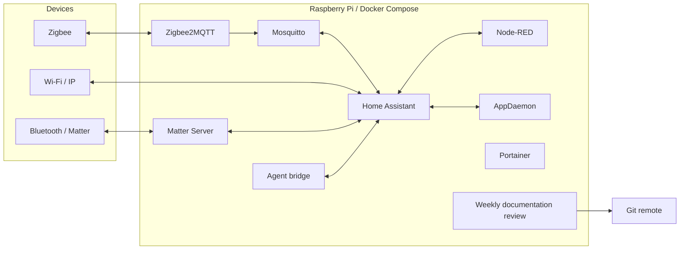

# Self-hosted smart home

[Português (primary)](README.md) · [English](README.en.md)

An event-driven home automation platform running on a Raspberry Pi with Docker
Compose. The repository contains the declarative configuration, flows, local
integrations, and operational tooling for Home Assistant, Node-RED, Mosquitto,
Zigbee2MQTT, AppDaemon, Matter Server, Portainer, and an optional coding-agent
bridge.

This public repository represents only the reviewable part of the system.
Credentials, coordinates, device registries, databases, Zigbee keys, and
pairing state must never be committed.

> A fresh clone can build and start the platform, but it cannot reproduce the
> original household. Restoring devices, identities, and history also requires
> a private backup of the files listed in the
> [installation and restore guide](docs/INSTALLATION_RESTORE.en.md).

## Architecture



| Service | Purpose | Default exposure |
| --- | --- | --- |
| Home Assistant | State, integrations, UI, and YAML automations | host network, port 8123 |
| Mosquitto | Local MQTT broker | `${HOST_LAN_IP}:1883` |
| Zigbee2MQTT | Zigbee coordinator and MQTT bridge | `${HOST_LAN_IP}:8080` |
| Node-RED | Event-driven, stateful flows | `${HOST_LAN_IP}:1880` |
| AppDaemon | Python applications | host network; UI on `127.0.0.1:5050` |
| Matter Server | Legacy containerized Matter controller | host network; WebSocket on `127.0.0.1:5580` |
| Portainer | Manual container operations | `${HOST_LAN_IP}:9000` |
| `ai-bridge` | Claude Code/Codex from Home Assistant | `127.0.0.1:8099` only |
| `docs-review-scheduler` | weekly documentation review and updates | no published port |

If `HOST_LAN_IP` is unset, published services bind to `127.0.0.1`. Nothing is
intentionally published on `0.0.0.0`.

## Quick start

Minimum requirements:

- Linux with Docker Engine 23 or newer and the `docker compose` plugin;
- an image-supported `linux/arm64` or `linux/amd64` host;
- Node.js on the host for setup and validation scripts;
- GNU Make for the project's canonical commands;
- host networking and D-Bus for Bluetooth/Matter;
- `/usr/bin/vcgencmd` for Raspberry Pi-specific health metrics.

```bash
git clone REPOSITORY_URL smart-home
cd smart-home
make bootstrap-test
make bootstrap
```

Bootstrap creates only missing private templates and reports gaps without
printing values. Edit `.env`, especially `HOST_LAN_IP`, and record the Docker socket GID if the
agent bridge will be enabled:

```bash
stat -c '%g' /var/run/docker.sock
```

Prepare the private files described by the installation guide, then run:

```bash
node scripts/setup-node-red-security.mjs
docker compose config --quiet
npm --prefix nodered ci
npm --prefix nodered run flows:validate
docker compose build ai-bridge
docker compose up -d
docker compose ps
```

Mosquitto requires `mosquitto/config/password.txt`; Zigbee2MQTT requires a
filled copy of `zigbee2mqtt/configuration.example.yaml`; and AppDaemon requires
`.local-secrets/appdaemon-secrets.yaml`. The safe procedure for both fresh installations and
restores is in [INSTALLATION_RESTORE.en.md](docs/INSTALLATION_RESTORE.en.md).
The documentation scheduler belongs to the optional `automation` profile and
must only be enabled after following
[WEEKLY_DOCUMENTATION_REVIEW.en.md](docs/WEEKLY_DOCUMENTATION_REVIEW.en.md).

## Reproducibility and updates

External images are pinned by digest. `scripts/docker-auto-update.mjs` checks
the selected release channels, updates Compose digests, validates the local
configuration, and recreates the stack only when needed. The bridge Dockerfile
also pins its base image and installed CLI versions.

`matter_server` deliberately retains the existing Python 8.1 controller
because its volume contains the installation fabric. That project is now in
maintenance mode and the ecosystem is moving to a matter.js-based server.
Migration needs a backup and explicit testing, so it is documented as a
planned migration instead of being applied silently. See
[Containers](docs/CONTAINERS.en.md).

## Security

`.gitignore` is authoritative for private runtime state. Excluded items include:

- `.env`, `.local-secrets/`, and every real `secrets.yaml`;
- `homeassistant/.storage/`, `.cloud/`, databases, and backups;
- `nodered/flows_cred.json` and session files;
- `mosquitto/config/password.txt`;
- `zigbee2mqtt/configuration.yaml`, network key, and coordinator backup;
- Portainer data and Matter fabric data.

Compose passes each service only the variables it needs. In particular, agent
bridge tokens are no longer injected into Node-RED. Audit before publishing:

```bash
scripts/security-scan.sh
scripts/security-scan.sh --staged
```

The scanner checks tracked files only and never prints a suspected secret.

## Validation

```bash
make validate-public
make backup-plan
make restore-test
make bootstrap-test
make demo-test
docker compose config --quiet
npm --prefix nodered run flows:validate
npm --prefix nodered run test:all
npm --prefix ia-bridge test
```

`make validate-public` checks documentation, versioned agent memory, privacy,
restore manifest/schema, bootstrap, demo, modules, and the weekly-review
contract without reading private runtime state.

`depends_on` orders container creation; it does not prove that a dependency is
ready. Check `docker compose ps` and service logs after startup.

## Documentation

- [English documentation index](docs/README.en.md)
- [Installation and restore](docs/INSTALLATION_RESTORE.en.md)
- [Deterministic restore contract](docs/RESTORE_CONTRACT.en.md)
- [Bootstrap, modules, and synthetic demo](docs/BOOTSTRAP_DEMO.en.md)
- [Containers, volumes, ports, and dependencies](docs/CONTAINERS.en.md)
- [Weekly documentation review](docs/WEEKLY_DOCUMENTATION_REVIEW.en.md)
- [Zigbee and Internet monitoring in Node-RED](docs/ZIGBEE_HEALTH_NOTIFICATIONS.en.md)
- [Codex + Local AI with RTX 4070 (Portuguese)](docs/LOCAL_AI_RTX_4070.md)
- [Versioned agent memory (Portuguese)](docs/MEMORIA_VERSIONADA_AGENTES.md)
- [Portuguese feature documentation](docs/README.md)

Brazilian Portuguese is the primary operational language. The repository
overview, documentation index, container guide, installation runbook, and
features marked as bilingual have complete English versions; the English
index summarizes and routes to the remaining Portuguese feature guides.
