# Self-hosted Smart Home Platform

[English (default)](README.md) · [Português](README.pt-BR.md)

[](https://github.com/gabrafur/my_smart_home/actions/workflows/public-validation.yml)
[](https://www.home-assistant.io/)
[](https://nodered.org/)
[](https://docs.docker.com/compose/)

A self-hosted, event-driven home-automation platform operated as versioned
infrastructure. Home Assistant, Node-RED, and MQTT form the core; optional
modules add Zigbee, AppDaemon, Matter, observability, and agent-assisted
automation without mixing public code with household state.



[Technical portfolio tour](docs/ENGINEERING_TOUR.md) · [Demo](#synthetic-demo) ·
[Getting Started](#start-in-five-minutes) ·
[Documentation](docs/README.en.md) ·
[Restore](docs/RESTORE_CONTRACT.en.md) ·
[Case study](docs/portfolio/technical-case-study-en.md)

## Why this project exists

Reliable home automation is state, failure, and recovery engineering—not just
device commands. This project makes those decisions reviewable through
configuration as code, event-driven flows, stale-state guards, observability,
CI, deterministic restore, and operational documentation.

It also demonstrates how to publish a real platform without publishing the
household. Physical IDs, registries, coordinates, credentials, maps, and
history remain private. Public code uses logical roles and synthetic fixtures;
a fresh clone reproduces platform, tests, and demo, never the original install.

## What it demonstrates

- Home Assistant as state model, UI, and integration layer;
- Node-RED state machines, deduplication, backoff, and restart recovery;
- MQTT/Mosquitto and Zigbee2MQTT for decoupled local integration;
- modular Docker Compose, digest-pinned images, and edge operation;
- YAML/Jinja automations, AppDaemon, and Python integrations;
- host, storage, Internet, and Zigbee observability;
- private bindings, security/privacy scanners, and responsible disclosure;
- manifest-driven backup/restore with verification, human approval, rollback;
- canonical CI, isolated runtime tests, and a no-real-I/O demo;
- optional Local AI/agents with explicit boundaries and content-free telemetry.

## Architecture

The public core is Home Assistant ↔ MQTT ↔ Node-RED. Zigbee2MQTT, AppDaemon,
cloud-backed integrations, and the agent bridge are optional. The diagram keeps
physical devices, private runtime, backup/restore, and the agent/Local-AI
boundary distinct. Bindings and physical state never enter Git; an encrypted
private bundle is applied only after plan, verify, and human confirmation. See
the [Mermaid source and reproduction](docs/assets/README.en.md).

## Engineering highlights

| Capability | Evidence | Why it matters |
| --- | --- | --- |
| Modular core | [`modules/features.json`](modules/features.json), [`compose.modules.yml`](compose.modules.yml), [check](scripts/modules-check.mjs) | a clone starts with three services and expands without implicit dependencies |
| Recoverable flows | [`flows.json`](nodered/flows.json), [replays](nodered/tools/test-security-recovery-flow.mjs), [adversarial cases](nodered/tools/test-security-recovery-adversarial.mjs) | restarts, event order, and invalid state fail safely |
| Observability | [monitoring](docs/ZIGBEE_HEALTH_NOTIFICATIONS.en.md), [host health](docs/RASPBERRY_PI_SYSTEM_HEALTH.md), [runtime tests](nodered/tools/test-infrastructure-monitoring-runtime.mjs) | outage, recovery, and deduplication are testable states, not only logs |
| Public/private boundary | [schema](bindings/public-bindings.schema.json), [model](docs/PRIVACY_MODEL.en.md), [scanner](scripts/privacy-check.mjs) | logic remains reviewable without exposing topology or physical identities |
| Disaster recovery | [manifest](restore/private-state-manifest.yaml), [implementation](scripts/restore.mjs), [tests](scripts/restore.test.mjs) | verify is read-only; apply validates its destination and prepares rollback |
| Canonical validation | [Makefile](Makefile), [CI](.github/workflows/public-validation.yml), [strategy](docs/TESTING_STRATEGY.en.md) | one local/remote command covers configuration, docs, privacy, and runtime |
| Provenance | [inventory](docs/DEPENDENCY_PROVENANCE.en.md), [notices](THIRD_PARTY_NOTICES.md) | vendored versions, licenses, and local deltas are explicit |
| Agent context | [contract](docs/MEMORIA_VERSIONADA_AGENTES.md), [recovery](scripts/ai-context-recovery.mjs) | agents resume from commit and public memory, never automatic private runtime |

## Technical portfolio tour

The [staged engineering tour](docs/ENGINEERING_TOUR.md) is organized for a
30-second architecture scan, a five-minute reliability/privacy review, and a
15-minute implementation walkthrough. It links directly to ten representative
implementation and test surfaces instead of repeating this README.

## Start in five minutes

Prerequisites: Linux, Git, Node.js 20, Python 3, GNU Make, Docker Engine, and
the Compose plugin.

```bash
git clone https://github.com/gabrafur/my_smart_home.git smart-home
cd smart-home
make bootstrap
make validate-public
make demo
make demo-test
```

`make bootstrap` creates missing private templates only, never overwrites
files, and reports gaps. Before starting containers, read
[installation/restore](docs/INSTALLATION_RESTORE.en.md) and configure your own
secrets, bindings, and hardware.

### Reference or contribution?

This is currently a **reference implementation and portfolio project**, not a
licensed starter template. The original work has no root license, so public
visibility and GitHub's template control must not be read as general permission
to reuse it. A fork is appropriate for proposing a contribution back through a
pull request; see [CONTRIBUTING](CONTRIBUTING.md).

GitHub currently exposes **Use this template**. That setting is intentionally
left unchanged pending the owner's explicit licensing/template decision; see
the [decision memo](docs/LICENSING_DECISION.md) and
[repository-settings audit](docs/GITHUB_REPOSITORY_SETTINGS.en.md).

## Execution boundaries

| Area | What runs | What never happens automatically |
| --- | --- | --- |
| Demo | in-memory logical events, no network/process/MQTT/device clients | no physical command or private-state read |
| Validation | parsers, scanners, tests, and an isolated Node-RED container with fixtures | it does not start the household stack or restore a real backup |
| Core | Home Assistant, Node-RED, and Mosquitto after private setup | optional modules are never inferred or enabled |
| Integrations | only with the selected module, binding, secret, and hardware | absence degrades safely; registries are not migrated |
| Restore | read-only plan/verify | apply needs a destination, explicit token, and human presence |
| Agents/Local AI | optional, allowed to process bounded public context | no secrets, production approval, security decision, or destructive authority |

## Stack

Home Assistant · Node-RED · Mosquitto/MQTT · Zigbee2MQTT · AppDaemon · Matter
Server · Docker Compose · Node.js · Python · YAML/Jinja · GitHub Actions ·
Mermaid · optional Codex/Local AI.

## Synthetic demo

```bash
make demo
make demo-test
```

The scenario covers logical presence, security, lighting, storage, and health
recovery, including alert deduplication, stale-event rejection, and an in-memory
restart/reload boundary. Its implementation imports no network, process, MQTT,
or device-control client. See [Bootstrap and demo](docs/BOOTSTRAP_DEMO.en.md)
and the [deterministic example output](docs/demo-output.md).

## Restore

The repository is the public layer; installation recovery state belongs in an
encrypted private bundle. Use `backup-plan`, `backup-verify`, `restore-plan`,
and `restore-verify`; `restore-apply` requires a confirmation token. Full
contract: [RESTORE_CONTRACT](docs/RESTORE_CONTRACT.en.md).

## Security and privacy

Run before publishing:

```bash
scripts/security-scan.sh --staged
make privacy-check-staged
```

Scanners never echo a finding's value. Report vulnerabilities through
[SECURITY](SECURITY.md), never a public issue. Vendored dependencies retain
their licenses; there is no root license because licensing original work is an
[intentional open decision](docs/LICENSING_DECISION.md).

## Repository map

```text
homeassistant/   Configuration, dashboards, packages, integrations
nodered/         Flows, settings, and runtime replays
bindings/        Public schema and synthetic example
modules/         Core/optional feature graph
restore/         Private-state manifest and schema
scripts/         Bootstrap, demo, restore, scanners, validation
docs/            Operations, architecture, cases, bilingual portfolio
.codex/memories/ Sanitized public agent memory
```

## Contributing

External contributions use a fork, branch, and PR; PT/EN updates and validation
are acceptance criteria. Read [CONTRIBUTING](CONTRIBUTING.md), the
[Code of Conduct](CODE_OF_CONDUCT.md), and
[third-party notices](THIRD_PARTY_NOTICES.md).

## Disclaimer

This is an independent engineering portfolio project. It is not a security
product, emergency service, or ready-made image for every household. Cloud
integrations and trademarks belong to their owners. Assess licensing, hardware,
risk, and local regulation before operating physical effects.
