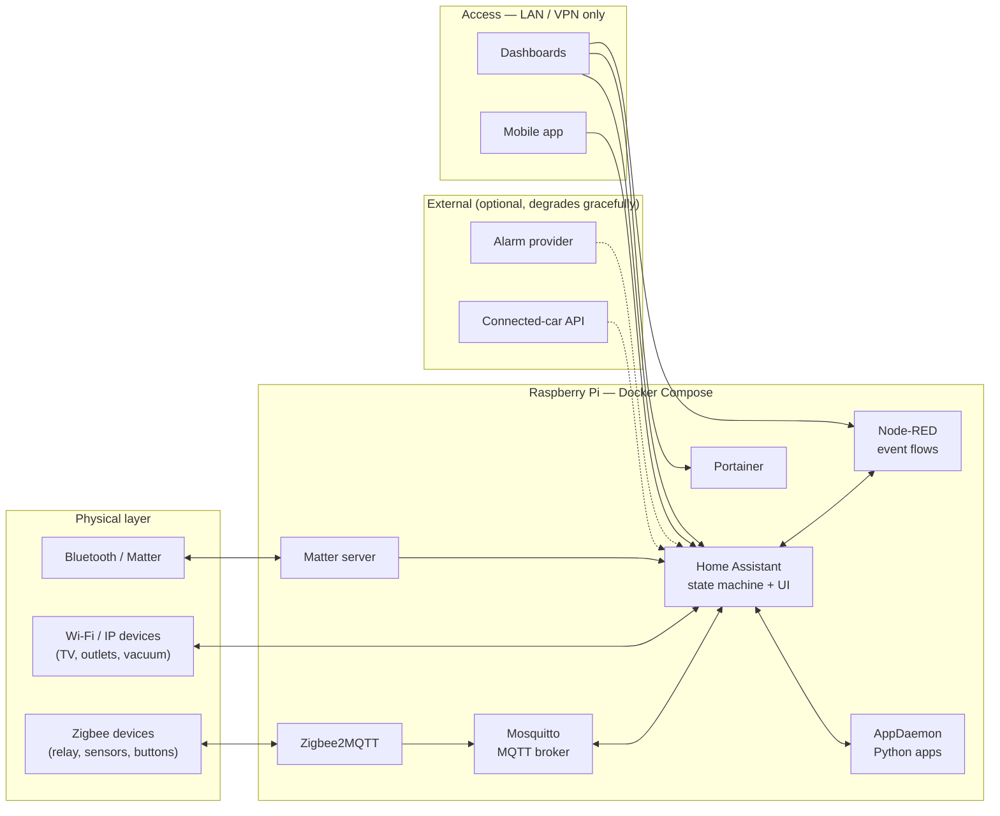

# my_smart_home

Event-driven home automation platform running on a single Raspberry Pi
(DietPi), self-hosted and self-managed. Everything here is the real
configuration and source behind a household stack that controls lighting, a
garage gate, an alarm panel, power outlets, media devices and a connected car —
deployed with Docker Compose, integrated over MQTT/Zigbee, and extended with
custom Python and JavaScript components.

**This repository is the reviewable part of that system, not a copy of the
house.** Runtime state — the Home Assistant entity/device registries, session
and auth stores, databases, Zigbee network keys, credentials and geographic
coordinates — is deliberately excluded (see [Security posture](#security-posture)).
What is versioned is the part worth reading: declarative configuration,
automation logic, integrations and operational tooling.

---

## Architecture



### Components and why each exists

| Component | Role |
| --- | --- |
| **Home Assistant** | The state machine and integration hub. Declarative config split into `homeassistant/packages/*.yaml`, one file per feature area, plus custom dashboards. |
| **Node-RED** | Where multi-step, stateful event logic lives — arrival detection, debouncing, gate pulses, notification fan-out. Flows are versioned as JSON in `nodered/flows.json` and organized into tabs per feature. |
| **Mosquitto** | MQTT broker; the bus between Zigbee2MQTT and Home Assistant. |
| **Zigbee2MQTT** | Talks to the Zigbee coordinator and publishes devices to MQTT — no vendor hub, no vendor cloud. |
| **AppDaemon** | Python runtime for logic that is easier to express as code than as YAML or as a flow. |
| **Matter server / Bluetooth** | Local device protocols; requires host D-Bus and `NET_ADMIN`/`NET_RAW` (see `docs/BLUETOOTH_MATTER.md`). |
| **Portainer** | Container visibility and manual intervention when a service misbehaves. |
| **claude-bridge** | A small Node HTTP service that exposes the Claude Code CLI to Home Assistant's conversation pipeline, so the stack can be queried and modified from inside the house UI. |

## Design principles

**Local first.** Automations execute on the Pi. The garage gate was
deliberately migrated from a vendor cloud scene to a local Zigbee relay pulse —
the cloud round-trip was the dominant source of latency. Cloud integrations
(connected car, alarm provider) are treated as *optional inputs*: flows are
written so that missing or stale cloud data degrades behaviour instead of
breaking it.

**Event-driven, not polling-first.** Zone crossings, device state changes and
MQTT messages drive the flows. Where polling is unavoidable (a vehicle API with
rate limits and a 12 V battery to protect), the cadence is adaptive — faster as
an arrival gets closer, throttled at night.

**Failure modes are designed, not discovered.** Real incidents are analysed and
the fix is written down: a frozen phone tracker that reported a stale position
for two days, an iOS geofence that reported nothing between two boundaries, a
vehicle API that returned 503 for days. The reasoning lives in `docs/`, and the
guards live in the flows.

**Configuration is code.** No unversioned clicking-in-the-UI as the source of
truth: feature areas are YAML packages, flows are JSON, integrations are Python,
and tooling is Node scripts committed alongside them.

## Custom integrations and tooling

Written for this stack, not vendored:

- **Python** — Home Assistant custom components: an alarm-panel integration
  built from a reverse-engineered protocol, a conversation agent, power
  control and Raspberry Pi health sensors (`homeassistant/custom_components/`,
  `homeassistant/tools/`).
- **JavaScript / Node** — flow validation and programmatic flow editing
  (`nodered/tools/`), MQTT credential rotation across all four consumers,
  a digest-pinned image update sweep, and the Claude Code HTTP bridge
  (`scripts/`, `claude-bridge/`).

## Operations

- **Reproducible deploys** — every image in `docker-compose.yml` is pinned by
  digest, not by tag, so a restore rebuilds the same stack.
- **Guarded updates** — `scripts/docker-auto-update.mjs` runs a scheduled image
  sweep and watches for Home Assistant integration updates, so upgrades are a
  reviewed event rather than a surprise.
- **Observability** — a Raspberry Pi health package tracks temperature, CPU,
  load, memory, swap and storage, and notifies before a threshold becomes an
  outage (`docs/RASPBERRY_PI_SYSTEM_HEALTH.md`).
- **Backups** — a nightly job commits and pushes configuration changes, with a
  secret-scanning gate that aborts the commit if a staged diff looks like it
  contains credentials.
- **Disaster recovery** — `docs/INSTALACAO_RESTAURACAO_SMART_HOME.md` is a full
  rebuild runbook for a bare Raspberry Pi, from OS install to running stack.

## Security posture

The repository is public on purpose; the house is not.

**Never versioned** (`.gitignore` is the authority):

| Excluded | Why |
| --- | --- |
| `homeassistant/.storage/` | Auth/session stores, but also device and entity registries — MAC/BSSID addresses, per-device unique ids, pairing identifiers, resident records. Ignored wholesale, with no per-file exceptions. |
| `homeassistant/secrets.yaml`, `.env`, `.local-secrets/` | Credentials, API tokens, alarm codes, and the home coordinates. |
| `zigbee2mqtt/configuration.yaml`, `coordinator_backup.json` | Zigbee network key and MQTT credentials. |
| `nodered/flows_cred.json`, `mosquitto/config/password.txt` | Node-RED and broker credentials. |
| `portainer/`, `matter-server/`, `*.db` | Application databases, certificates and fabric credentials. |

**Indirection instead of literals.** Values that must exist in config but must
not exist in git are referenced, not embedded: Home Assistant YAML uses
`!secret`, and Node-RED function nodes read geographic constants from the
container environment. The arrival flow is written so that a missing
coordinate degrades to Home Assistant's own zone state rather than computing
distances from an invalid value.

**Automated enforcement.** `scripts/security-scan.sh` audits *tracked files
only*, checks that the ignore rules still cover the private state, matches
common token/key/coordinate/MAC patterns, and never prints a candidate
secret's value. It runs in CI on every push and pull request
(`.github/workflows/security-scan.yml`, `permissions: contents: read`) and can
be run locally against a staged diff:

```bash
scripts/security-scan.sh            # all tracked files
scripts/security-scan.sh --staged   # pre-commit
```

**History.** The scan and the ignore rules govern the current tree. Files
removed from tracking still exist in earlier commits; see
[`docs/AUDITORIA_SEGURANCA_REPO_PUBLICO.md`](docs/AUDITORIA_SEGURANCA_REPO_PUBLICO.md)
for what is in the history and the options for cleaning it.

## Remote access

No public port-forwarding. Every LAN-bound service is published only on the
host's LAN address and is reachable from outside solely over a VPN overlay
(Tailscale, with ZeroTier documented as a fallback). If the host IP variable is
missing, Docker Compose binds to `127.0.0.1` rather than `0.0.0.0` — a
deliberate guard against accidental exposure.

## Documentation

One write-up per feature: the design, the constraints, the failure that
motivated it, and the reasoning behind non-obvious decisions.

- [Installation / restore runbook](docs/INSTALACAO_RESTAURACAO_SMART_HOME.md) — full rebuild for a fresh Pi
- [Garage gate — local Zigbee relay](docs/PORTAO_GARAGEM_RELE_LOCAL.md) — replacing a cloud scene with a local relay pulse
- [Security lighting (Node-RED)](docs/ILUMINACAO_SEGURANCA_NODERED.md) · [External lighting (Node-RED)](docs/ILUMINACAO_EXTERNA_NODERED.md)
- [Alarm panel integration](docs/INTEGRACAO_MONI_MOBILE_INTELBRAS.md) — reverse-engineered protocol, scope deliberately limited to arm/disarm
- [Connected-car integration](docs/CRETA_KIA_UVO_INTEGRATION.md) — endpoint/parser fix for a multi-day upstream outage
- [Raspberry Pi health monitoring](docs/RASPBERRY_PI_SYSTEM_HEALTH.md) · [Energy control](docs/CONTROLE_ENERGIA_HOME_ASSISTANT.md)
- [Bluetooth / Matter](docs/BLUETOOTH_MATTER.md) · [Wake-on-LAN](docs/WAKE_ON_LAN_TV_SALA.md)
- [Claude Code in the Home Assistant UI](docs/CHAT_CLAUDE_CODE_HA.md)
- [Public-repo security audit](docs/AUDITORIA_SEGURANCA_REPO_PUBLICO.md)

Most write-ups are in Portuguese, matching the language the system is operated in.
