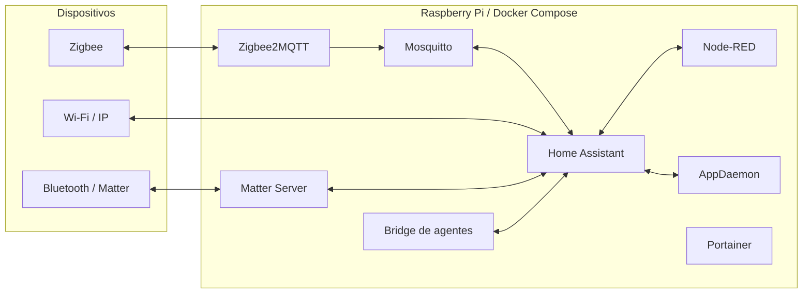

# Casa inteligente autogerenciada

[Português (principal)](README.md) · [English](README.en.md)

Plataforma de automação residencial orientada a eventos, executada em um
Raspberry Pi com Docker Compose. O repositório contém a configuração
declarativa, os fluxos, integrações locais e ferramentas operacionais de Home
Assistant, Node-RED, Mosquitto, Zigbee2MQTT, AppDaemon, Matter Server,
Portainer e um bridge opcional para agentes de código.

Este repositório é público e representa somente a parte revisável do sistema.
Credenciais, coordenadas, registros de dispositivos, bancos, chaves Zigbee e
estado de emparelhamento nunca devem entrar no Git.

> Um clone novo permite construir e iniciar a plataforma, mas não reproduz a
> residência original. Para recuperar dispositivos, identidades e históricos,
> também é necessário um backup privado dos arquivos listados no guia de
> [instalação e restauração](docs/INSTALACAO_RESTAURACAO_SMART_HOME.md).

## Arquitetura



| Serviço | Função | Exposição padrão |
| --- | --- | --- |
| Home Assistant | Estado, integrações, UI e automações YAML | rede do host, porta 8123 |
| Mosquitto | Broker MQTT local | `${HOST_LAN_IP}:1883` |
| Zigbee2MQTT | Coordenador Zigbee e ponte MQTT | `${HOST_LAN_IP}:8080` |
| Node-RED | Fluxos event-driven e lógica com estado | `${HOST_LAN_IP}:1880` |
| AppDaemon | Aplicações Python | rede do host; UI em `127.0.0.1:5050` |
| Matter Server | Controlador Matter legado em container | rede do host; WebSocket em `127.0.0.1:5580` |
| Portainer | Operação manual dos containers | `${HOST_LAN_IP}:9000` |
| `claude-bridge` | Claude Code/Codex dentro do HA | somente `127.0.0.1:8099` |

Se `HOST_LAN_IP` não estiver definido, os serviços publicados ficam presos a
`127.0.0.1`. Não há publicação intencional em `0.0.0.0`.

## Início rápido

Requisitos mínimos:

- Linux com Docker Engine 23 ou superior e o plugin `docker compose`;
- arquitetura `linux/arm64` ou `linux/amd64` suportada pelas imagens;
- Node.js no host para os scripts de preparação e validação;
- D-Bus e rede do host para Bluetooth/Matter;
- `vcgencmd` no caminho `/usr/bin/vcgencmd` para as métricas específicas do
  Raspberry Pi.

```bash
git clone URL_DO_REPOSITORIO smart-home
cd smart-home
cp .env.example .env
```

Edite `.env`, principalmente `HOST_LAN_IP`, e grave o GID real do socket
Docker se for usar o bridge:

```bash
stat -c '%g' /var/run/docker.sock
```

Prepare os arquivos privados descritos no guia de instalação. Em seguida:

```bash
node scripts/setup-node-red-security.mjs
docker compose config --quiet
npm --prefix nodered ci
npm --prefix nodered run flows:validate
docker compose build claude-bridge
docker compose up -d
docker compose ps
```

O Mosquitto exige `mosquitto/config/password.txt`; o Zigbee2MQTT exige uma
cópia preenchida de `zigbee2mqtt/configuration.example.yaml`; e o AppDaemon
exige `.local-secrets/appdaemon-secrets.yaml`. O procedimento seguro, inclusive para uma
instalação sem backup anterior, está em
[INSTALACAO_RESTAURACAO_SMART_HOME.md](docs/INSTALACAO_RESTAURACAO_SMART_HOME.md).

## Reprodutibilidade e atualização

As imagens externas estão fixadas por digest. O script
`scripts/docker-auto-update.mjs` consulta os canais escolhidos, atualiza os
digests no Compose, valida a configuração e recria a stack somente quando há
mudança. O Dockerfile do bridge também fixa a imagem-base e as versões dos
CLIs instalados.

O `matter_server` ainda usa o controlador Python 8.1 existente porque o volume
contém a fabric da instalação. Esse projeto entrou em manutenção e o caminho
atual do ecossistema é o servidor baseado em matter.js. A troca exige backup e
teste de migração; portanto ela está documentada como migração deliberada, não
como atualização silenciosa. Consulte [Containers](docs/CONTAINERS.md).

## Segurança

O `.gitignore` é a autoridade para estado privado. Entre os itens excluídos:

- `.env`, `.local-secrets/` e qualquer `secrets.yaml` real;
- `homeassistant/.storage/`, `.cloud/`, bancos e backups;
- `nodered/flows_cred.json` e arquivos de sessão;
- `mosquitto/config/password.txt`;
- `zigbee2mqtt/configuration.yaml`, chave de rede e backup do coordenador;
- dados do Portainer e da fabric Matter.

O Compose passa a cada serviço somente as variáveis de que ele precisa. Em
especial, tokens do bridge não são mais injetados no Node-RED. Rode a auditoria
antes de publicar:

```bash
scripts/security-scan.sh
scripts/security-scan.sh --staged
```

O scanner examina somente arquivos rastreados e nunca imprime o valor de um
possível segredo. A análise do histórico e as ações de rotação estão em
[AUDITORIA_SEGURANCA_REPO_PUBLICO.md](docs/AUDITORIA_SEGURANCA_REPO_PUBLICO.md).

## Validação

```bash
docker compose config --quiet
npm --prefix nodered run flows:validate
npm --prefix nodered run flows:test-alarm-arrival
npm --prefix nodered run flows:test-security
npm --prefix claude-bridge test
scripts/security-scan.sh
node scripts/docs-check.mjs
```

`depends_on` ordena a criação, mas não confirma que uma dependência está
pronta. Depois de subir a stack, confira `docker compose ps` e os logs de cada
serviço.

## Documentação

- [Índice da documentação](docs/README.md)
- [Instalação e restauração](docs/INSTALACAO_RESTAURACAO_SMART_HOME.md)
- [Containers, volumes, portas e dependências](docs/CONTAINERS.md)
- [Bluetooth e Matter](docs/BLUETOOTH_MATTER.md)
- [Segurança do repositório público](docs/AUDITORIA_SEGURANCA_REPO_PUBLICO.md)
- [Saúde do Raspberry Pi](docs/RASPBERRY_PI_SYSTEM_HEALTH.md)
- [Bridge de agentes no Home Assistant](docs/CHAT_CLAUDE_CODE_HA.md)

Os guias operacionais detalhados são mantidos em português do Brasil, idioma
principal da instalação. O README, o índice, o guia de containers e o runbook
de instalação têm versões completas em inglês. O índice em inglês resume e
encaminha os documentos de funcionalidades específicas.
