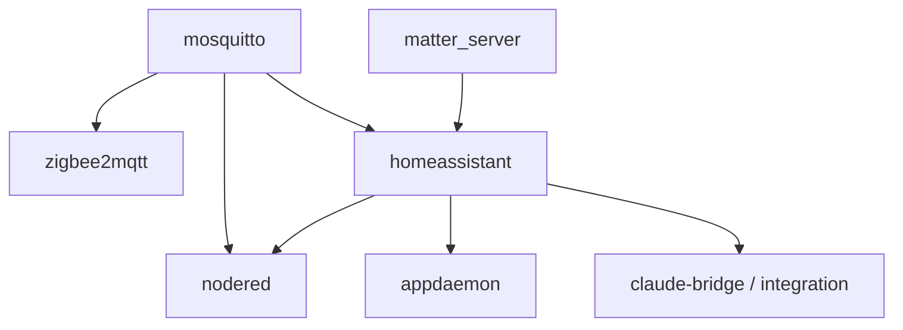

# Containers, dependencies, and operations

[Português (primary)](CONTAINERS.md) · [English](CONTAINERS.en.md)

This is the current reference for `docker-compose.yml`. Compose is the source
of truth for exact digests and settings; this guide explains the rationale,
host requirements, and private files that cannot be inferred from YAML alone.

## Stack matrix

| Service | Source | Network/port | Persistence | Required private files |
| --- | --- | --- | --- | --- |
| `portainer` | digest-pinned image | `${HOST_LAN_IP}:9000` | `./portainer:/data` | full volume to restore user and state |
| `mosquitto` | digest-pinned image | `${HOST_LAN_IP}:1883` | `./mosquitto/{config,data,log}` | `config/password.txt` |
| `homeassistant` | digest-pinned image | host network, UI 8123 | `./homeassistant:/config` | `secrets.yaml`, `.storage/`, optional databases |
| `matter_server` | digest-pinned image | host network, WebSocket on `127.0.0.1:5580` | `./matter-server:/data` | full Matter fabric volume |
| `appdaemon` | digest-pinned image | host network, UI on `127.0.0.1:5050` only | runtime in `./appdaemon`, config in `./templates/appdaemon` | `.local-secrets/appdaemon-secrets.yaml` |
| `nodered` | digest-pinned image | `${HOST_LAN_IP}:1880` | `./nodered:/data` | `flows_cred.json` after credentials are configured |
| `zigbee2mqtt` | digest-pinned image | `${HOST_LAN_IP}:8080` | `./zigbee2mqtt:/app/data` | `configuration.yaml`, database, coordinator backup |
| `claude-bridge` | local build | `127.0.0.1:8099` only | auth volumes and workspace | `.env` bridge token and optional OAuth token |

Published ports use `HOST_LAN_IP`; when it is absent, they bind to loopback.
Home Assistant, AppDaemon, and Matter use host networking because they require
local discovery, D-Bus, or direct Home Assistant access.

The Zigbee2MQTT frontend may have no built-in authentication, depending on the
private `configuration.yaml`. A LAN bind is not a firewall: restrict ports
1880, 1883, 8080, and 9000 to a trusted LAN/VPN. AppDaemon, the Matter
WebSocket, and the bridge remain loopback-only.

## Images and versions

All external images, including the bridge base image, are pinned by digest.
Tags such as `stable` and `latest` are used only as channels checked by
`scripts/docker-auto-update.mjs`; containers are never recreated from a
mutable tag directly.

The bridge uses Node.js 22 Bookworm Slim and pins the Claude Code and Codex CLI
versions in its Dockerfile. Debian packages still come from the official APT
repository during builds, so critical components are pinned but builds are not
byte-for-byte APT snapshots.

### Matter status

The current service is Python Matter Server 8.1, temporarily retained to avoid
risking the existing fabric. Upstream is in maintenance mode and the successor
is matter.js-based. Home Assistant OS is the officially supported path;
self-managed containers require correct IPv6/mDNS networking and are used here
with that limitation understood.

Do not replace the image or delete `matter-server/` during a routine update.
Before migrating:

1. back up the Matter volume and Home Assistant;
2. confirm the target version's migration procedure;
3. test against a copy of the volume;
4. validate both Wi-Fi and Thread devices;
5. retain a Compose and volume rollback.

## Host dependencies

- Docker Engine 23+ and the Compose plugin;
- `/run/dbus` for Bluetooth;
- working IPv6 and mDNS for Matter/Thread;
- `/etc/localtime`, `/etc/os-release`, `/proc`, and `/sys` for Home Assistant
  and host metrics;
- `/usr/bin/vcgencmd` on Raspberry Pi. Remove that bind and disable dependent
  sensors on other hardware;
- `/var/run/docker.sock` for Portainer and the bridge. This socket grants
  Docker-administrative capability, so neither service should be public.

The socket GID differs between hosts. Set `DOCKER_GID` to:

```bash
stat -c '%g' /var/run/docker.sock
```

Compose adds that supplementary group to the bridge at runtime instead of
baking a host-specific GID into the image.

## Variables by service

Compose no longer uses a broad `env_file` inside containers. This prevents an
agent token from being copied into Node-RED when Node-RED does not need it.

| Variable | Consumer | Required |
| --- | --- | --- |
| `TZ` | all services | no; defaults to `America/Sao_Paulo` |
| `HOST_LAN_IP` | bridged ports | recommended; loopback if absent |
| `NODE_RED_ADMIN_*` | Node-RED | yes for a protected editor |
| `HOME_LAT/LON`, `GATE_LAT/LON` | arrival flow | no; safe fallback exists |
| `DOCKER_GID` | bridge | yes for Docker commands |
| `CLAUDE_BRIDGE_TOKEN` | bridge and HA integration | yes to use the endpoint |
| `CLAUDE_CODE_OAUTH_TOKEN` | Claude CLI | optional if auth volume is used |
| `HA_LONG_LIVED_TOKEN` | host update script | optional; prefer `.local-secrets/` |

`ANTHROPIC_API_KEY` is explicitly blanked inside the bridge so the CLI cannot
accidentally choose API billing when OAuth is intended.

Conversation timeout is **900 seconds** in both the bridge and the Home
Assistant custom component. Compose fixes `BRIDGE_TIMEOUT_MS=900000` so an old
private `.env` value cannot restore the former five-minute window. Update both
sides together whenever this limit changes.

Requests sharing an `agent:conversation_id` are serialized, while unrelated
conversations remain parallel. The bridge persists a `pending` turn before
starting the CLI, kills the full process group on timeout, and handles a Codex
thread conflict with one retry in a fresh session. The private JSONL history
coalesces the pending and final records by turn ID.

## Service dependencies



`depends_on` is not a health check. Home Assistant and Node-RED may need extra
time after `docker compose up -d`; inspect logs and integrations before calling
the deployment healthy.

## Build, pull, and startup

```bash
docker compose config --quiet
docker compose pull
docker compose build --pull claude-bridge
docker compose up -d
docker compose ps
```

The bridge build needs internet access for APT and npm. Pulling needs Docker Hub
and GHCR. On ARM64 and AMD64, manifest digests resolve the matching platform.

## Per-service validation

```bash
docker compose ps
docker compose logs --tail=100 mosquitto zigbee2mqtt
docker compose logs --tail=100 homeassistant matter_server
docker compose logs --tail=100 nodered appdaemon
docker compose logs --tail=100 portainer claude-bridge
```

- Home Assistant: `http://HOST_IP:8123` plus its in-container config check.
- Mosquitto: authenticated publish/subscribe on a test topic.
- Zigbee2MQTT: `zigbee2mqtt/bridge/state` reports `online`.
- Zigbee alerts: availability is enabled, the bridge entity exists, and an
  offline/online cycle is checked as described by the
  [dedicated guide](ZIGBEE_HEALTH_NOTIFICATIONS.en.md).
- Node-RED: editor authentication is required and flow tests pass.
- Matter: the HA integration connects to `ws://127.0.0.1:5580/ws`.
- AppDaemon: logs show no secret or app-loading errors.
- Portainer: onboarding or restored state is available only on LAN/VPN.
- Bridge: loopback `GET /health` and one authenticated test request.

## Backup and restore

Git covers configuration, not runtime state. Privately and securely back up:

- `.env` and `.local-secrets/`;
- `homeassistant/secrets.yaml`, `.storage/`, selected databases and backups;
- `nodered/flows_cred.json` and authentication files;
- `mosquitto/config/password.txt` and persistent data;
- `zigbee2mqtt/configuration.yaml`, `database.db`, and
  `coordinator_backup.json`;
- `.local-secrets/appdaemon-secrets.yaml`;
- the `matter-server/` and `portainer/` directories.

Do not commit that backup, even encrypted, without an explicit key-management
and retention policy.

## Updates and rollback

```bash
node scripts/docker-auto-update.mjs daily --dry-run
node scripts/docker-auto-update.mjs daily
```

The script discovers its repository path and no longer depends on
`/mnt/data/docker`. It backs up Git, resolves digests, validates Compose and
Node-RED, and only then recreates services. Database, fabric, or protocol
migrations still require upstream release-note review and an external backup.

For rollback, restore both Compose and compatible volumes. Reverting only an
image digest may fail after an application migrates its database.

## Verified official references

- [Docker Engine on Debian](https://docs.docker.com/engine/install/debian/)
- [Docker Compose plugin on Linux](https://docs.docker.com/compose/install/linux/)
- [Home Assistant Container on Raspberry Pi](https://www.home-assistant.io/installation/raspberrypi-other/)
- [Home Assistant Matter integration](https://www.home-assistant.io/integrations/matter/)
- [Python Matter Server in Docker](https://github.com/matter-js/python-matter-server/blob/main/docs/docker.md)
- [Zigbee2MQTT configuration](https://www.zigbee2mqtt.io/guide/configuration/)
- [Zigbee2MQTT device availability](https://www.zigbee2mqtt.io/guide/configuration/device-availability.html)
