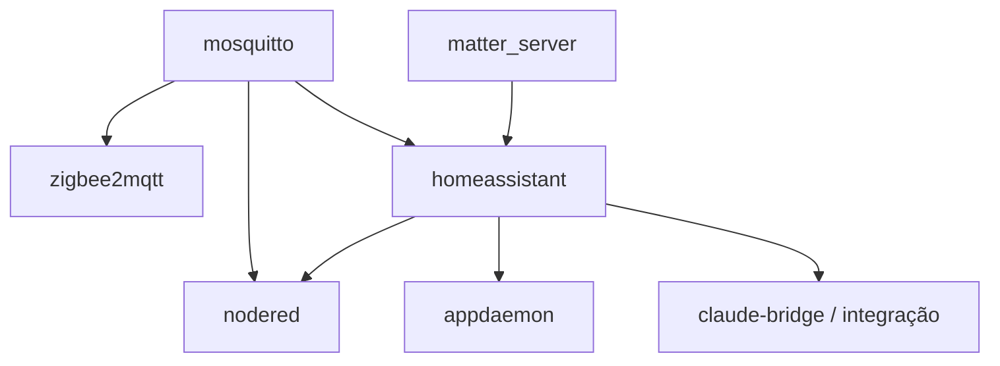

# Containers, dependências e operação

[Português (principal)](CONTAINERS.md) · [English](CONTAINERS.en.md)

Este documento é a referência atual do `docker-compose.yml`. O Compose é a
fonte de verdade para digests e detalhes exatos; este guia explica os motivos,
pré-requisitos e arquivos privados que não podem ser deduzidos apenas do YAML.

## Matriz da stack

| Serviço | Origem | Rede/porta | Persistência | Arquivos privados obrigatórios |
| --- | --- | --- | --- | --- |
| `portainer` | imagem por digest | `${HOST_LAN_IP}:9000` | `./portainer:/data` | volume inteiro para restaurar usuário e estado |
| `mosquitto` | imagem por digest | `${HOST_LAN_IP}:1883` | `./mosquitto/{config,data,log}` | `config/password.txt` |
| `homeassistant` | imagem por digest | `network_mode: host`, UI 8123 | `./homeassistant:/config` | `secrets.yaml`, `.storage/`, bancos opcionais |
| `matter_server` | imagem por digest | `network_mode: host`, WebSocket em `127.0.0.1:5580` | `./matter-server:/data` | volume inteiro da fabric |
| `appdaemon` | imagem por digest | `network_mode: host`, UI somente em `127.0.0.1:5050` | runtime em `./appdaemon`, config em `./templates/appdaemon` | `.local-secrets/appdaemon-secrets.yaml` |
| `nodered` | imagem por digest | `${HOST_LAN_IP}:1880` | `./nodered:/data` | `flows_cred.json` quando houver credenciais já configuradas |
| `zigbee2mqtt` | imagem por digest | `${HOST_LAN_IP}:8080` | `./zigbee2mqtt:/app/data` | `configuration.yaml`, banco e backup do coordenador |
| `claude-bridge` | build local | somente `127.0.0.1:8099` | volumes de autenticação e workspace | `.env` com token do bridge e, opcionalmente, OAuth |

As portas publicadas usam `HOST_LAN_IP`. A ausência da variável faz o bind em
loopback. Home Assistant, AppDaemon e Matter usam rede do host porque dependem
de descoberta local, D-Bus ou acesso direto ao HA.

O frontend do Zigbee2MQTT pode não ter autenticação própria, dependendo do
`configuration.yaml` privado. Binding na LAN não substitui firewall: mantenha
1880, 1883, 8080 e 9000 restritas à LAN/VPN confiável. AppDaemon, o WebSocket
do Matter e o bridge permanecem em loopback.

## Imagens e versões

Todas as imagens externas, inclusive a base do bridge, usam digest. Tags como
`stable` e `latest` aparecem somente na lista de canais consultada por
`scripts/docker-auto-update.mjs`; não são usadas para recriar containers
diretamente.

O bridge usa Node.js 22 Bookworm Slim e fixa as versões do Claude Code e Codex
no Dockerfile. Pacotes Debian continuam vindo do repositório oficial durante o
build, portanto o build é determinístico para as partes críticas, mas não é uma
reprodução byte a byte de um snapshot APT.

### Estado do Matter

O serviço atual é o Python Matter Server 8.1, mantido temporariamente para não
arriscar a fabric existente. O projeto upstream está em modo de manutenção e o
servidor novo é baseado em matter.js. Home Assistant OS é o caminho oficialmente
suportado; o container autogerenciado exige rede IPv6/mDNS correta e é usado
aqui conscientemente.

Não troque a imagem nem apague `matter-server/` como parte de uma atualização
rotineira. Antes da migração:

1. faça backup do volume e do Home Assistant;
2. confirme o procedimento de migração da versão de destino;
3. teste em uma cópia do volume;
4. valide dispositivos Wi-Fi e Thread;
5. mantenha um rollback do volume e do Compose.

## Dependências do host

- Docker Engine 23+ e plugin Compose;
- `/run/dbus` para Bluetooth;
- rede IPv6 e mDNS funcionais para Matter/Thread;
- `/etc/localtime`, `/etc/os-release`, `/proc` e `/sys` para o Home Assistant e
  as métricas do host;
- `/usr/bin/vcgencmd` em Raspberry Pi. Em outro hardware, remova esse bind e
  desabilite os sensores que dependem dele;
- `/var/run/docker.sock` para Portainer e o bridge. Esse socket equivale a
  acesso administrativo ao Docker; não exponha esses serviços publicamente.

O GID do socket varia por host. Preencha `DOCKER_GID` com:

```bash
stat -c '%g' /var/run/docker.sock
```

O Compose adiciona esse grupo ao processo do bridge em runtime, sem gravar um
GID específico na imagem.

## Variáveis por serviço

O Compose não usa mais `env_file` nos containers. Essa decisão impede que um
token de agente seja copiado para o ambiente do Node-RED sem necessidade.

| Variável | Consumidor | Obrigatória |
| --- | --- | --- |
| `TZ` | todos | não; padrão `America/Sao_Paulo` |
| `HOST_LAN_IP` | portas bridged | recomendada; loopback se ausente |
| `NODE_RED_ADMIN_*` | Node-RED | sim para editor protegido |
| `HOME_LAT/LON`, `GATE_LAT/LON` | fluxo de chegada | não; há degradação segura |
| `DOCKER_GID` | bridge | sim para comandos Docker |
| `CLAUDE_BRIDGE_TOKEN` | bridge e integração HA | sim para usar o endpoint |
| `CLAUDE_CODE_OAUTH_TOKEN` | CLI Claude no bridge | opcional se autenticado pelo volume |
| `BRIDGE_TIMEOUT_MS` | bridge | não; padrão 300000 ms |
| `HA_LONG_LIVED_TOKEN` | script no host | opcional; prefira arquivo em `.local-secrets/` |

O `ANTHROPIC_API_KEY` é explicitamente esvaziado dentro do bridge para evitar
que a CLI escolha por acidente a cobrança por API quando a instalação usa OAuth.

## Dependências entre serviços



`depends_on` não é health check. Após `docker compose up -d`, Home Assistant e
Node-RED podem levar mais tempo para aceitar conexões. Observe logs e valide as
integrações antes de considerar o deploy concluído.

## Build, pull e inicialização

```bash
docker compose config --quiet
docker compose pull
docker compose build --pull claude-bridge
docker compose up -d
docker compose ps
```

O build do bridge precisa de internet para APT e npm. O pull precisa alcançar
Docker Hub e GHCR. Em ARM64 e AMD64, o digest de manifesto resolve a variante
correta da plataforma.

## Validação por serviço

```bash
docker compose ps
docker compose logs --tail=100 mosquitto zigbee2mqtt
docker compose logs --tail=100 homeassistant matter_server
docker compose logs --tail=100 nodered appdaemon
docker compose logs --tail=100 portainer claude-bridge
```

- Home Assistant: `http://IP_DO_HOST:8123` e check de configuração dentro do
  container.
- Mosquitto: publicação e assinatura autenticadas em um tópico de teste.
- Zigbee2MQTT: `zigbee2mqtt/bridge/state` retorna `online`.
- Node-RED: editor exige autenticação e os testes de fluxo passam.
- Matter: integração HA conecta em `ws://127.0.0.1:5580/ws`.
- AppDaemon: log não contém erro de segredo ou carregamento de app.
- Portainer: onboarding ou estado restaurado aparece somente na LAN/VPN.
- Bridge: `GET /health` em loopback e uma chamada autenticada de teste.

## Backup e restauração

O Git cobre configuração, não estado. Faça backup privado e criptografado de:

- `.env` e `.local-secrets/`;
- `homeassistant/secrets.yaml`, `.storage/`, banco e backups necessários;
- `nodered/flows_cred.json` e arquivos de autenticação;
- `mosquitto/config/password.txt` e dados persistentes;
- `zigbee2mqtt/configuration.yaml`, `database.db` e
  `coordinator_backup.json`;
- `.local-secrets/appdaemon-secrets.yaml`;
- diretórios `matter-server/` e `portainer/`.

Não coloque esse arquivo de backup no repositório, mesmo criptografado, sem uma
política explícita de chaves e retenção.

## Atualização e rollback

```bash
node scripts/docker-auto-update.mjs daily --dry-run
node scripts/docker-auto-update.mjs daily
```

O script descobre o próprio diretório, portanto não depende mais de
`/mnt/data/docker`. Ele faz backup Git, resolve digests, valida Compose e
Node-RED e só então recria os serviços. Mudanças de banco, fabric ou protocolo
ainda exigem leitura das notas upstream e backup externo.

Para rollback, restaure o Compose e os volumes compatíveis. Reverter apenas o
digest pode não funcionar depois que uma aplicação migra seu banco.

## Referências oficiais verificadas

- [Docker Engine no Debian](https://docs.docker.com/engine/install/debian/)
- [Plugin Docker Compose no Linux](https://docs.docker.com/compose/install/linux/)
- [Home Assistant Container no Raspberry Pi](https://www.home-assistant.io/installation/raspberrypi-other/)
- [Integração Matter do Home Assistant](https://www.home-assistant.io/integrations/matter/)
- [Python Matter Server em Docker](https://github.com/matter-js/python-matter-server/blob/main/docs/docker.md)
- [Configuração Zigbee2MQTT](https://www.zigbee2mqtt.io/guide/configuration/)
