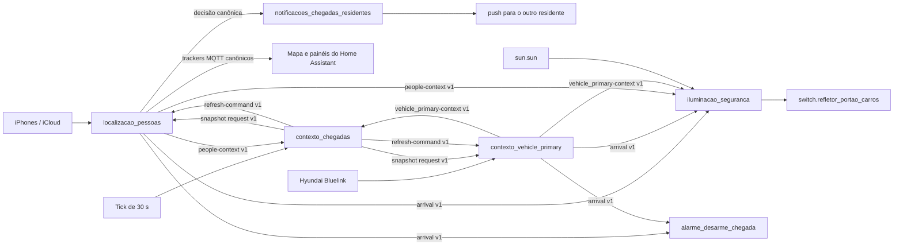
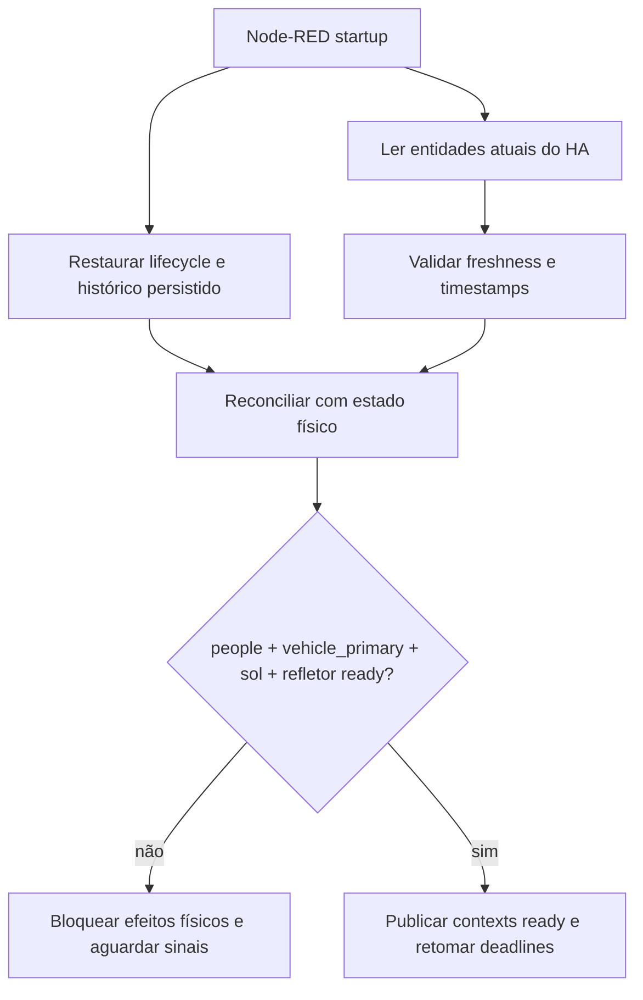

# Contexto de chegada e iluminação de segurança no Node-RED

Os flows relacionados ficam em `nodered/flows.json` e são divididos em cinco
abas:

| Flow | Responsabilidade |
| --- | --- |
| `localizacao_pessoas` | Ler e normalizar os trackers de resident_primary e resident_secondary, comprovar um ciclo externo individual, separar visualmente saída de retorno, detectar aproximação/chegada e controlar o refresh dos iPhones. |
| `contexto_vehicle_primary` | Normalizar localização, motor e trava do vehicle_primary, manter `vehicle_primary_in_use`, comprovar o ciclo externo, separar visualmente saída de retorno, detectar chegada, atualizar viagens e controlar o refresh do veículo. |
| `contexto_chegadas` | Sincronizar visualmente os snapshots periódicos e calcular somente a política conjunta `anyone_away`. Não interpreta GPS bruto nem envia notificações entre residentes. |
| `notificacoes_chegadas_residentes` | Consumir a chegada canônica de `localizacao_pessoas` e avisar o outro residente nos estágios `approach` ou `home`, durante as 24 horas do dia e sem recalcular zonas ou lifecycle. |
| `iluminacao_seguranca` | Consumir os contratos de alto nível e decidir ligar/desligar `switch.refletor_portao_carros`, incluindo carência, timeout e anti-religamento. |

Essa separação impede que a iluminação conheça trackers, coordenadas, refresh
da Kia ou detalhes de viagem.

## Arquitetura



A comunicação usa `link in`/`link out`. Os links são contratos explícitos; não
há wire direto entre abas, MQTT intermediário, entidade auxiliar ou produtor
oculto em `global context`.

## Contratos entre flows

### `security.people-context.v1`

Produzido somente por `localizacao_pessoas`. Contém:

- `resident_primary` e `resident_secondary` já normalizados;
- `distance_m`, `gate_distance_m`, precisão e validade;
- `current_home` (tracker selecionado e fresco), `primary_home`,
  `any_tracker_home` e tempo do tracker primário em casa;
- `anyone_away`, menor distância observada e armado individual;
- metadados da transição que originou a atualização;
- `updated_at`, `valid`, `ready`, `stale`, `source` e `reason`. Cada pessoa
  também publica `updated_at`, `ready` e `stale`.

### `security.vehicle_primary-context.v1`

Produzido somente por `contexto_vehicle_primary`. Contém:

- distância e validade da localização;
- `home`, `away`, `approaching_home` e `arrived_home`;
- motor, trava e validade desses estados;
- `in_use` (`true`, `false` ou `null` enquanto pendente), `in_use_pending`,
  `in_use_reason`, lifecycle de viagem e armado de chegada;
- `updated_at`, `valid`, `ready`, `stale`, `reason` e `readiness_reason`.

### `security.arrival.v1`

Produzido por `localizacao_pessoas` ou `contexto_vehicle_primary` após validar uma
chegada. Preserva o contrato consumido pelo alarme:

- `source`: `resident_primary`, `resident_secondary` ou `vehicle_primary`;
- `arriving`: lista contendo a origem;
- `arrival_source_type`: `person` ou `vehicle_primary`;
- `arrival_stage`: `approach` ou `home`;
- `arrival_direction: returning` e `external_cycle_confirmed: true`, exigidos
  também pelo gate final da iluminação;
- `event_at`: epoch Unix em milissegundos da observação usada para dedupe.

### Snapshot e refresh

`contexto_chegadas` cria um `refresh_cycle_id`, solicita os dois snapshots e
publica `security.refresh-command.v1` depois que ambos respondem no mesmo
ciclo. `ready: false` não bloqueia o comando: ele o promove a recovery. O
comando inclui `origin`, `reason`, `issued_at` e readiness; isso evita
duplicação e torna loops diagnosticáveis. Cada domínio continua dono de seu
cooldown. Snapshots com `updated_at` anterior ao cache são ignorados.

O canvas é a fonte dos parâmetros ajustáveis desse coordenador: agenda de
30 s, timeout do ciclo em voo de 10 s (limite 1–60 s) e tolerância de timestamp
futuro de 60 s (limite 0–300 s). Um candidato inválido é rejeitado sem substituir
a última política válida. Switches nomeados tornam visíveis a coalescência, a
aceitação monotônica, a espera pelos dois domínios, a precedência da saída de
morador e o motivo final do recovery. As funções remanescentes somente adaptam
contratos ou fazem mutações atômicas de cache; nenhuma contém esses números ou
chama efeitos.

Os controles `TESTE 1: reset coordenado` e `TESTE 2: ciclo recovery` usam
estado sintético separado e percorrem produtores e consumidores reais até as
fronteiras `vehicle_primary_refresh_dry_run_terminal_v1`,
`light_full_dry_run_terminal_v1` e
`resident_notifications_dry_run_terminal`, sempre com `simulated: true` e
`dispatched: false`.

## Entidades

### Pessoas

- `device_tracker.mobile_primary_source_1` e `_source_2`
- `device_tracker.mobile_secondary_source_1` e `_source_2`
- `device_tracker.resident_primary_location` e
  `device_tracker.resident_secondary_location` (resultados MQTT canônicos)
- chamadas ao hub móvel com destinatário explícito, incluindo push e o perfil
  `background_command` para `request_location_update`

A seleção existe somente nos blocos visuais de `localizacao_pessoas` e usa
`location_observed_at`, publicado pelo adapter a partir de
mudanças observáveis de estado, coordenadas ou precisão. Atualizações de
bateria e outros metadados não tornam uma localização fresca. Entre fontes com
coordenadas confiáveis e frescas, vence sempre a mudança de posição mais
recente; a melhor precisão só desempata observações simultâneas. Uma fonte sem
precisão aceitável não vence uma posição alternativa confiável. A decisão de
entrada no anel usa somente a fonte selecionada: um fallback antigo em `home`
não bloqueia uma posição recente em `near_home`.

O grupo `0. Política canônica de localização — edite os números` é a fonte
única dos dois raios de decisão (`home` e `near_home`), além de
freshness, desempate, precisão, movimento e retenção de chegada. Os links
nomeados levam a mesma política às abas de veículo e
iluminação. O Node-RED também publica no Home Assistant a fonte vencedora e os
indicadores já calculados de posição atual, fonte reportando e GPS confiável;
o painel não repete esses cálculos.

### vehicle_primary

- `device_tracker.vehicle_primary`
- `device_tracker.vehicle_primary_location_nodered` (saída canônica para mapa
  e painel)
- `binary_sensor.vehicle_primary_engine`
- `lock.vehicle_primary_door_lock`
- `button.vehicle_primary_force_refresh`
- `button.garagem_vehicle_primary_refresh_trip_info`
- `input_button.vehicle_primary_force_refresh_now` (solicitacao manual pelo mesmo
  coordenador; ignora cooldown/backoff, mas nao uma chamada em andamento)
- `sensor.vehicle_primary_refresh_coordinator` (espelho MQTT do estado/deadlines reais)
- `sensor.vehicle_primary_location_since_nodered` (instante canônico da posição atual)
- entidades do dispositivo atualizadas pelo serviço `homeassistant.update_entity`

### Iluminação

- `sun.sun`
- `switch.refletor_portao_carros`
- notificações dos iPhones dos moradores

## Coordenadas e fallback

`HOME_LAT`, `HOME_LON`, `GATE_LAT` e `GATE_LON` vêm do ambiente do container;
coordenadas privadas nunca são versionadas. O cálculo só aceita GPS com
precisão de até 100 m. Sem coordenada confiável, `home` e `near_home` não
confirmam chegada; `not_home` ainda pode armar o retorno de forma conservadora.
`unknown` e `unavailable` produzem `state_valid: false`. Nenhum desses casos
gera chegada nem limpa o armado anterior.

O alias público `device_tracker.vehicle_primary` preserva os dados nativos do
Home Assistant com `state_mode: passthrough`. O bloco visual `Classificar home
/ near_home` converte coordenadas confiáveis em `home`,
`near_home` ou `not_home` antes do normalizador e do tracker MQTT canônico.
`away` não é estado do tracker; é o booleano derivado no contrato
`security.vehicle_primary-context.v1`, usando primeiro coordenadas confiáveis e
depois `not_home` como fallback. O checker de bindings rejeita
`home_away` em `device_tracker`, pois esse modo apagaria a distinção entre
`near_home` e `not_home`.

## Regras de chegada preservadas

- O bloco `Raio home (m)` classifica casa/fora, mas distância
  sozinha nunca arma nem comprova uma chegada.
- O ciclo de retorno só é armado por uma observação externa separada da própria
  borda de saída, em `not_home` ou outra zona externa ao par
  `home`/`near_home`, ou pela borda direcional externa `-> near_home`. Um único
  salto `home -> not_home -> home` não basta.
- O estado `near_home` é calculado somente pelo Node-RED quando a fonte
  selecionada cruza o raio configurado ao redor da casa ou do portão. A zona
  `zone.location_update_ring`, de 1.500 m, apenas acorda o Companion App do iOS;
  seu nome e seu raio não participam das decisões, painéis ou automações.
- Se todas as posições disponíveis ultrapassarem a janela de frescor de 15
  minutos, o tracker canônico publica `unavailable` e não repete como atual o
  último `home` ou `near_home`. O diagnóstico preserva o estado bruto, a fonte
  e os horários, mas não republica coordenadas vencidas.
- `home -> near_home` é saída, limpa o armado anterior e nunca é chegada.
- Um rebote posterior `near_home -> home` continua bloqueado enquanto não houver
  ciclo externo confirmado. Pessoas e veículo terminam em blocos visuais
  `BLOQUEADO`, sem iluminação, alarme, notificação ou chamada externa.
- A entrada no anel gera `arrival_stage: approach` e não consome o armado.
- Somente depois do ciclo externo, a entrada em `near_home` ou a reavaliação
  dentro do raio configurado da casa/portão pode publicar a chegada e consumir
  o armado (700 m por padrão).
- O bloco `Raio near_home (m)`, dentro do grupo
  `0. Política canônica de localização — edite os números`, guarda o raio em
  metros. Edite o valor do inject, entre 50 e 1.500 m, e faça Deploy para
  aplicá-lo a pessoas, veículo, iluminação e atributos dos painéis.
- `Raio home (m)` controla somente a classificação de casa. O antigo
  parâmetro `Raio refresh rápido (m)` foi removido porque não participava da
  cadência efetiva: o iOS responde aos geofences e às mudanças significativas,
  enquanto pedidos explícitos são reservados ao recovery com limite de duas
  vezes por hora. A validação exige `home < near_home` e rejeita uma combinação
incoerente sem substituir a última política válida.
- Enquanto uma chegada confirmada permanece armada em `near_home`, uma vigília
  individual pede uma atualização extraordinária somente ao iPhone daquele
  morador após 10 minutos. Ela não usa o cooldown genérico de 30 minutos: a
  primeira tentativa é preventiva e a segunda fica reservada para quando motor
  ou bypass se tornarem válidos com a posição vencida. O aceite do push nunca
  vira prova de localização.
- Um tracker primário que já está em casa há mais de 10 min bloqueia o catch-up
  tardio do tracker secundário. Sem `last_changed`, o comportamento permanece
  fail-open para não perder uma chegada real.
- Recovery `unknown`/`unavailable -> near_home` só alcança a iluminação quando
  recupera um ciclo externo que já estava armado antes da indisponibilidade.
- Uma saída curta `home -> near_home` abre um ciclo local por até 90 min, sem
  ser tratada como chegada e sem acender o refletor. O fluxo primeiro confirma
  o `on` da saída; somente um `off` posterior e outro `on`, com a localização
  atual do morador ainda em `near_home` ou já em `home`, autorizam a iluminação.
- A chegada do vehicle_primary atualiza o histórico de viagens do dia; no estágio
  `approach`, também tenta um wake pontual do veículo.
- Atualizações de atributos do tracker também são observadas sem exigir troca
  de zona. Um deslocamento acumulado de pelo menos 250 m (ou maior que a soma
  das precisões GPS) solicita refresh do contexto, mas nunca autoriza sozinho
  a iluminação ou outra ação física.

## Notificações entre residentes

O tab `notificacoes_chegadas_residentes` recebe apenas a transição canônica
`security.arrival.v1` decidida em `localizacao_pessoas`; ele não observa trackers
brutos nem recalcula zonas. Uma chegada confirmada com ciclo externo notifica o
outro residente imediatamente, tanto no estágio `approach` quanto na chegada
direta ao estágio `home`, sem consultar horário, sol, veículo ou os snapshots de
`contexto_chegadas`. A transição `home -> near_home` continua sendo saída e não
gera aviso. O dedupe persistente da entrega evita repetição entre fontes e após
restart.

No tab `alarme_desarme_chegada`, a confirmação deixou de ser uma função
monolítica. O canvas valida contrato, origem, estágio, direção e ciclo externo;
depois mostra separadamente estado armado, pendência, entrega em voo, cooldown,
token, expiração, cancelamento e confirmação. A política visual concentra
cooldown de 60 s, TTL real de 300 s, janela de entrega de 30 s e TTL de teste de
120 s, todos validados e sem fallback oculto. A pendência real só é promovida
quando o Home Assistant aceita ao menos uma notificação; falha de entrega não
arma cooldown. O teste usa pendência isolada e termina no terminal dry-run sem
enviar notificação nem intenção de desarme.

A política fica no primeiro grupo do canvas: dedupe da entrega de 10 minutos,
idade máxima de 15 minutos, tolerância futura de 60 segundos e retry do serviço
de 60 segundos. Dedupe e idade aceitam de 1 a 60 minutos, a tolerância futura
de 0 a 5 minutos e o retry de 10 a 600 segundos. O bloco de validação rejeita
configurações inválidas sem substituir a última política persistente válida.
Contrato, tipo, direção, ciclo externo, estágio, origem, timestamp, futuro,
stale, reserva, duplicidade, destinatário, retry e produção/teste são decisões
visuais nomeadas. O estado persistente registra somente que o Home Assistant
aceitou a chamada; isso não comprova que o iOS exibiu o aviso. Os pushes reais
pedem som padrão e nível `time-sensitive`, preservando a entrega visível mesmo
com o aplicativo em segundo plano. Uma falha do serviço libera a reserva e
permite no máximo três tentativas.

Os testes sintéticos iniciados em `localizacao_pessoas` também entram nesse tab.
Eles percorrem a mesma validação e o mesmo dedupe usando memória isolada, mas
terminam em `TESTE FINAL: nenhum push enviado`, com `simulated=true` e
`dispatched=false`. Os testes 1–9 do próprio tab também são dry-run. O botão
`TESTE 10` é a única exceção explícita: envia somente um push claramente
marcado `TESTE` ao `mobile_secondary`, para confirmar o canal ponta a ponta,
sem acionar luz, Alexa, alarme ou qualquer outro dispositivo.

O nome exibido na mensagem é resolvido em runtime a partir do `source_alias`
privado do residente. O flow versionado preserva apenas os papéis lógicos; se o
alias estiver ausente ou for inválido, a mensagem falha fechado para o papel sem
persistir dados privados no repositório.

O JavaScript remanescente é limitado à validação estrutural da política,
adaptação do evento, leitura/escrita do lifecycle persistente, composição do
texto com alias privado e registro dos terminais. Thresholds e decisões não
ficam nesses adaptadores.

O bypass do motor segue o mesmo contrato: o canvas mostra separadamente
startup, ativação automática por falha, verificação de posse no recovery,
ativação/desativação manual e rejeição. Assim, a recuperação da API só desliga
um bypass que tenha sido adquirido automaticamente; um `ON` manual é
preservado. O antigo coordenador JavaScript dessa regra foi removido.

Quando um teste de localização também satisfaz as condições de acendimento,
inclusive com atuador `unknown`, `unavailable`, stale ou não reconciliado, o
diagnóstico segue apenas ao terminal dry-run. Refletor, notificações, alarme,
timers e todos os demais dispositivos permanecem sem efeitos.

## Freshness e `vehicle_primary_in_use`

Freshness é calculada com `last_updated` (ou `last_changed` como fallback),
sempre em epoch Unix UTC, milissegundos:

| Sinal | Janela | Ao expirar |
| --- | ---: | --- |
| trackers de resident_primary e resident_secondary | 15 min | pessoa `stale`, snapshot não ready; nunca vira `false` |
| localização do vehicle_primary | 30 min | localização `stale` não participa do acendimento; chegada de morador continua usando apenas motor/API do carro, nunca sua posição |
| motor | 5 min | idade fica diagnóstica e pode motivar wake; `on`/`off` conhecidos não expiram apenas pelo tempo |
| trava | 5 min | sinal inválido/stale; não confirma destravamento atual |
| snapshots derivados | monotônico por `updated_at` | antigo e futuro >60 s são descartados; conflito no mesmo timestamp preserva o primeiro |

O estado pertence exclusivamente a `contexto_vehicle_primary`:

- liga quando o motor conhecido é `on`, mesmo que o evento do sensor seja
  antigo, enquanto a comunicação com o Bluelink estiver saudável;
- desliga quando o motor conhecido é `off`, também sem expirar apenas pela
  idade, enquanto a comunicação com o Bluelink estiver saudável;
- após restart, uma viagem persistida só é restaurada como `true` quando a
  localização atual e fresca ainda confirma que o carro está fora;
- sem evidência suficiente publica `in_use: null`, `in_use_pending: true`, e a
  iluminação permanece bloqueada. Nunca converte stale automaticamente em
  `false`.

Mudanças confirmadas de motor são observadas simetricamente: `on` por 5 s e
`off` por 5 s entram imediatamente no normalizador. Isso evita esperar o
próximo snapshot periódico para iniciar ou encerrar o contexto de uso, mantendo
o mesmo filtro contra oscilações nos dois sentidos.

Quando uma chegada `not_home -> near_home` ocorre antes do anoitecer ou antes de
a integração atualizar o motor, `iluminacao_seguranca` preserva a intenção por
até 15 minutos, valor editável no mesmo grupo de política canônica. Durante
esse prazo, uma aproximação de morador exige que a mesma pessoa permaneça em
`near_home`, com localização `ready` e não stale. A posição do veículo não cria
nem mantém intenção de acendimento. A intenção é cancelada ao entrar em
`home`, sair de `near_home`, perder a atualidade da localização ou vencer a
janela. Assim, uma entrada às 17:31 ainda pode ser reavaliada se o pôr do sol ou
a telemetria do motor convergirem alguns minutos depois.

O replay exige luminosidade ready e `below_horizon`. O gate normal exige
`in_use=true`, motor `on` conhecido e comunicação saudável com o Bluelink. A chave
`switch.garagem_vehicle_primary_bypass_do_motor_para_iluminacao_de_chegada`
oferece uma alternativa somente quando uma tentativa real de wake/API falha;
a idade do evento do motor, isoladamente, não libera o bypass. Quando há falha
real de comunicação, porém, o último `off` deixa de ser prova atual e o bypass
automático pode liberar o refletor; essa prioridade deliberadamente favorece
um possível acendimento antecipado em vez de perder a chegada. O
estado da posição do carro nunca autoriza o acendimento. Em chegadas de
moradores, essa posição é apenas diagnóstica: `ON` conhecido e API saudável
liberam o gate, enquanto `OFF` conhecido e API saudável continuam bloqueando.
O Node-RED liga a chave automaticamente enquanto a API do veículo está em falha
ou backoff. Se ela já estava ligada manualmente, a automação não assume a
posse nem a desliga na recuperação; um `ON` automático só volta para `OFF`
depois que a API confirma recuperação. A intenção só é removida depois que o despacho de acendimento passa
por todos os gates, ou quando uma das condições de cancelamento ocorre.

O gate não usa apenas a leitura ao vivo do motor porque o backend brasileiro
pode manter esse sensor antigo durante uma viagem. A iluminação recebe apenas
`context.in_use` e não sabe como a trava foi calculada.

`security.vehicle_primary-context.v1` foi mantido em `v1` após a auditoria dos
consumidores reais do repositório. A ampliação de `in_use` de booleano para
`true | false | null` não é puramente aditiva, mas todos os consumidores estão
no mesmo conjunto de flows e usam comparação estrita com `true`; nenhum
consumidor externo ou legado foi encontrado. `null` bloqueia o gate e não é
interpretado como `false`. Uma fronteira externa futura deverá publicar uma
nova versão em vez de assumir essa compatibilidade interna.

## Acendimento

`iluminacao_seguranca` liga o refletor somente quando todas as condições são
verdadeiras:

1. há um evento `security.arrival.v1` com `arrival_direction: returning` e
   `external_cycle_confirmed: true`;
2. a origem é `resident_primary` ou `resident_secondary`, o estágio é
   `approach`, a transição vem de `not_home` ou outra zona externa para
   `near_home` (ou recupera um ciclo externo já armado), e a localização atual
   da mesma pessoa permanece `ready`, não stale e em `near_home`; evento do carro,
   estágio `home`, saída, rebote ou evento malformado termina em `BLOQUEADO`;
3. `sun.sun` está `below_horizon`;
4. `vehicle_primary_in_use` é verdadeiro e o motor atual está `on`, **ou** o
   bypass manual ou automático está ligado e a telemetria do motor está comprovadamente não
   confiável;
5. pessoas, sol e estado físico do refletor estão ready/reconciliados; o
   readiness do motor é obrigatório no caminho normal e dispensado apenas pelo
   bypass restrito descrito acima;
6. o refletor físico está `off` e não foi marcado como ativo por chegada;
7. não há supressão pós-desligamento ativa.

Depois de todos os gates, a ação grava no store `persistent` o lifecycle
`security_light_lifecycle_v1`: `active_by_arrival`, `on_since`,
`force_off_at`, dedupe recente e `updated_at`. Eventos barrados por claridade,
readiness ou estado do vehicle_primary não consomem o dedupe do refletor.

A origem do acendimento pode ser somente `resident_primary` ou
`resident_secondary`. Quando o motor atual está `on`, a entrada de qualquer
residente em `near_home` aciona a avaliação independentemente da posição do
veículo. Para residentes, o retorno precisa estar armado por
`not_home` ou outra zona externa. `unknown`/`unavailable` só recuperam um armado
externo já existente; não criam uma chegada. Essas transições de recovery ficam
restritas à iluminação e não são publicadas como chegada geral para o desarme.

A exceção para uma parada próxima também é restrita à iluminação. A borda
`home -> near_home` apenas abre o ciclo local configurável (90 min por padrão).
O fluxo registra o primeiro `on` como partida e só aceita um `off` posterior a
ele; então outro `on` pode representar a volta. Um snapshot `off` enquanto o
carro ainda nem foi ligado não arma o retorno. Assim, a saída inicial não é
confundida com chegada; o segundo `on` reavalia imediatamente a pessoa com
localização atual em `near_home` ou `home`.

O evento de chegada leva também um snapshot mínimo da localização canônica que
o produziu. Se o evento e o contexto percorrerem links diferentes, essa
evidência monotônica impede que o gate ainda leia por alguns milissegundos a
posição anterior e bloqueie uma entrada válida em `near_home`.

Se o motor muda para `on` depois que o morador já entrou em `near_home`, o evento
confirmado de motor reavalia imediatamente a chegada enquanto o ciclo externo
daquela pessoa continuar armado e a localização ainda estiver atual. Se a
posição já venceu, o fluxo solicita uma leitura nova somente ao telefone dessa
pessoa e aguarda o callback: `near_home` atual permite a reavaliação; `home`,
saída do raio ou nova ausência de localização permanecem bloqueados. Um mero
snapshot repetindo motor `on`, ou um morador em `near_home` sem ciclo externo,
não recria a chegada. A ativação válida do bypass durante falha comprovada da
integração faz a mesma reavaliação, inclusive se a intenção temporária de 15
minutos já tiver expirado.

O estado `sensor.security_light_last_decision` registra no Recorder a última
decisão canônica (`turned_on`, bloqueios por claridade, motor, localização,
direção ou `waiting_location_refresh`) com apenas papéis lógicos e timestamps.
Isso permite backtests futuros sem inferir o motivo a partir do estado físico
do refletor.

Também chama `switch.turn_on`, avisa os moradores e inicia o backstop de 15
minutos.

Se um residente chega ao estágio `home` enquanto o lifecycle do refletor ainda
está ativo, o canvas agenda uma atualização extraordinária do carro para 90
segundos depois dessa confirmação de `home`. O prazo não começa na entrada em
`near_home` nem no acendimento do refletor. Quando vence, a solicitação atravessa
o deadline periódico de 30 minutos e a pausa noturna, mas continua serializada
pelo controle de chamada em andamento. A confirmação de `home` não desliga a
luz diretamente: somente a telemetria nova com motor `off` e porta destravada
usa o caminho normal de desligamento antes do backstop de 15 minutos.

O primeiro ciclo que liga o refletor — ou que determinaria o acendimento, mas
encontra o atuador `unknown`, `unavailable`, stale ou não reconciliado — grava
um latch persistente de notificação. Enquanto esse latch estiver ativo, novas
chegadas não repetem avisos de `turn on` nem de “seria ligado”. Uma observação
física confirmada em `off` libera o latch; `on` o mantém mesmo que o Zigbee
fique indisponível logo depois.

## Desligamento e confirmação pós-chegada

| # | Condição | Efeito |
| --- | --- | --- |
| 1 | motor desligado e porta destravada | imediato, após o filtro de 5 s do evento do veículo |
| 2 | refletor ativo por 15 min | imediato ao vencer o backstop |

Uma transição confirmada de `resident_primary` ou `resident_secondary` para
`home` agenda, em uma pendência independente por morador, `vehicle_refresh_at`
para 90 segundos depois; o estágio
`near_home` não cria esse prazo e a posição `home` do próprio veículo também
não o cria. O agendamento continua válido quando a integração do carro está
indisponível, pois sua finalidade é justamente pedir uma leitura nova. Uma
atualização genérica da trava não ignora o filtro de 5 s. O backstop grava
`force_off_at`. Após desligar, `cooldown_until` bloqueia religamento por cinco
minutos. Os prazos são absolutos e reconstruídos no restart; nenhum depende
exclusivamente de um `delay` residente em memória.

## Refresh

- Tick base: 30 s, com snapshot de pessoas e vehicle_primary.
- iPhones: geofences e mudanças significativas do iOS produzem os eventos
  responsivos. O veículo fora, sozinho, não solicita localização dos telefones.
  Se o contexto precisar de recuperação, o pedido explícito tem cooldown de
  30 min, limitado a duas vezes por hora. Uma posição vencida inicia recovery
  mesmo quando a última observação indicava `home`: um heartbeat recente sem
  avanço de `location_observed_at` não prova uma posição atual e não bloqueia
  o pedido seletivo ao telefone correspondente. O cooldown impede que o tick
  de 30 s transforme essa recuperação em polling contínuo. As duas primeiras
  tentativas podem ocorrer com 30 min de intervalo; sem evidência nova, o
  backoff cresce para 1 h, 2 h e no máximo 4 h. Uma observação realmente nova
  zera o backoff.
  A única exceção é a vigília de uma chegada já comprovada: aos 10 minutos em
  `near_home`, ou quando motor/bypass se tornam válidos com posição vencida,
  ela pede atualização ao telefone correspondente, com dedupe próprio. A
  segunda tentativa ocorre após 1 minuto sem posição nova, inclusive com motor
  desligado. Cada observação realmente nova reinicia essa vigília, permitindo
  acompanhar uma parada longa perto de casa. Sem resposta, são no máximo duas
  sondas por observação; ao vencer o frescor, a decisão canônica registra
  `location_refresh_failed` uma vez. Um aceite do serviço ou o mesmo GPS ainda
  dentro dos 15 minutos não conta como callback novo. O refletor continua
  bloqueado com localização vencida.
- `request_location_update` é best-effort: `public_bindings` agenda a
  notificação móvel sem aguardar a conclusão do serviço remoto. O aceite do
  Home Assistant não comprova uma posição nova; o ciclo seguinte reavalia os
  trackers. Desconexão ou timeout transitório atualiza somente o status local,
  sem criar um segundo erro no nó tratador; falhas inesperadas continuam sendo
  notificadas pelo observador a partir do nó de serviço original.
- No iOS, a permissão de localização `Sempre` é necessária, mas não garante
  execução em segundo plano. Quando uma fonte deixa de reportar, atualize e
  abra o Companion App no servidor correto, confirme Localização Precisa,
  Atualização em 2º Plano, Dados Celulares e Notificações, não force o
  encerramento do aplicativo e redefina o Push ID se ele estiver ausente.
  O painel só volta a declarar a fonte saudável após um callback real do
  telefone.
- vehicle_primary: a política fica visível no tab `contexto_vehicle_primary`,
  nos grupos `3. Configuração dos intervalos do veículo` e `4. Política
  visual`. Os seis injects numéricos são a única configuração: 1 min quando
  há aproximação em `near_home` e o motor está `off`, 5 min com motor `on`,
  15 min quando está `not_home`, 30 min
  no ciclo saudável quando ambos estão `home`, início 0h e fim 6h para a pausa
  noturna nessa última condição.
  Para mudar um valor, abra o inject correspondente, altere o número e faça
  Deploy. Essa presença usa a mesma fonte de melhor localização mostrada no
  mapa; divergência de uma fonte não selecionada fica apenas no diagnóstico.
  Uma chegada externa armada em `near_home` não perde a frequência rápida só
  porque o telefone venceu: sua última posição continua sendo intenção de
  refresh, limitada pela janela canônica de 90 min e sem autorizar efeitos.
  O contrato entre abas transporta o horário real de cada morador. A proximidade
  atual do veículo também pode acelerar somente o polling; sua posição não
  autoriza o refletor. Ambos os moradores atuais em `home` encerram essa faixa.
  Motor desconhecido mantém 1 min apenas quando há chegada externa/local armada;
  sem essa confirmação continua com 5 min. Fora desse estado, a recuperação do
  próprio veículo usa o intervalo configurado para fora, inclusive em casa,
  fora dessa pausa noturna; um bloqueio explícito do provedor ainda pode impor
  backoff maior. O coordenador, o aceite/erro da API e o dashboard não
  recalculam esses números; consomem o resultado e a telemetria desses blocos.
- A transição confirmada de qualquer residente de `home` para `near_home` ou
  `not_home` dispara imediatamente um `force_refresh` do vehicle_primary,
  independentemente do deadline periódico. Esse comando acorda o veículo e
  busca o estado novo para determinar se o morador está usando o carro. Eventos
  repetidos são deduplicados e uma chamada realmente em andamento continua
  serializada.
- A transição confirmada de chegada ao estágio `home`, independentemente do
  lifecycle do refletor, agenda para 90 segundos depois uma atualização
  extraordinária pelo mesmo
  coordenador. Ela atravessa o intervalo normal de 30 minutos e a pausa
  noturna; `near_home` não agenda essa confirmação. O bypass é uma decisão
  visual nomeada no tab de iluminação; não existe agendador JavaScript
  paralelo.
- O Node-RED é o único agendador de wake real. No backend brasileiro, o
  `kia_uvo` no Home Assistant lê somente o cache do Bluelink a cada 15 min;
  esse polling não acorda o carro nem chama o agendador nativo de force
  refresh. Respostas de rate limit ativam backoff progressivo de 15 min a 6 h
  e bloqueiam wakes e releituras adicionais até o prazo vencer.
- Entrada no anel/chegada: a solicitação volta por um par `link out`/`link in`
  ao mesmo coordenador persistente, em vez de chamar o binding diretamente.
- Mudança de zona ou deslocamento GPS significativo: solicita avaliação
  imediata do refresh e marca motor/contexto como potencialmente stale. O wake
  ainda respeita o intervalo vigente de 15 ou 30 min. A posição de referência é persistida somente
  para dedupe; logs registram tipo de movimento e distância arredondada, nunca
  latitude/longitude.
- O heartbeat `source_reported_at` preserva o horário real da fonte através dos
  aliases. Ele diagnostica atividade, mas não renova `location_observed_at` nem
  autoriza chegada usando coordenadas antigas.
- O refresh do vehicle_primary persiste tentativa, próxima tentativa e último sucesso.
  Também persiste `request_in_flight` com lease conservador; o Home Assistant
  mantém um lock adicional no botão privado. Assim, duas entradas simultâneas
  são coalescidas e no máximo uma chamada alcança a API.
  Falhas reais usam 15 min fora da pausa noturna; com ambos em casa, a janela
  00:00–05:59 não produz wake automático. Se uma chamada ficar sem conclusão,
  o fluxo pode reler o cache com `kia_uvo.update`, aguardar 15 s e reavaliar a
  telemetria; cache idêntico não invalida o estado conhecido. Se a integração ainda
  não carregou e o serviço não existe, o fluxo não faz essa chamada: reagenda
  o retry em 15 min e libera a releitura imediatamente quando as entidades
  reaparecem. Sucesso
  limpa tentativas e aplica o mesmo intervalo normal. O contador satura no
  quinto estágio. Não há rajada no restart porque
  `last_request_at` e `next_allowed_at` são persistidos e o piso é reconstruído
  a partir do último despacho e estendido no aceite da chamada. Assim, o prazo
  selecionado começa quando o serviço retorna, sem uma próxima tentativa alguns
  segundos antes do piso interno do backend.
- O clique `Atualizar agora` usa `reason=manual_force` e ignora o deadline
  automatico. O lease do Node-RED e o lock do Home Assistant continuam
  serializando chamadas; depois do aceite manual, a agenda automatica recomeça
  em 15 ou 30 minutos conforme a presença atual. O botão também funciona na
  pausa noturna.
- O retorno de `public_bindings.call` confirma apenas o transporte. O wake só
  tem sucesso quando `sensor.vehicle_primary_last_updated_at` avança além do
  baseline da tentativa. `401 Unauthorized`, timeout e ausência de dados novos
  mantêm backoff; o polling de cache BR continua recuperando autenticação e
  telemetria sem descarregar o config entry.
- `ON`/`OFF` antigos continuam confiáveis apenas enquanto a comunicação com a
  API estiver saudável. `engine_communication_failed` é ativado por falha real
  da chamada, inclusive wake aceito sem telemetria nova, e só é limpo depois de
  avanço semântico confirmado. Durante a falha, o bypass automático pode
  superar um `OFF` antigo para não perder o acendimento de chegada.
- A chamada legada `homeassistant.update_entity` que acompanhava o refresh do
  vehicle_primary continua sincronizando os dois trackers de iPhone, mas agora por um
  contrato explícito `contexto_vehicle_primary -> localizacao_pessoas`; nenhuma entidade
  de pessoa permanece dentro do flow do veículo.

Quando o refresh é motivado por alguém fora, a distância usada para escolher
30 s ou 60 s considera os trackers de pessoas. A presença estacionária dos
dois residentes não é mais confundida com falha de GPS e não cria um loop de
`request_location_update` a cada tick.

## Restart, persistência e readiness

`nodered/settings.js` mantém o store padrão `memoryOnly` e oferece o store
nomeado `persistent` (`localfilesystem`). Somente intenção e histórico limitado
optam por ele; entidades atuais do HA continuam sendo a verdade física. O
inventário completo está em
[`SECURITY_CONTEXT_RECOVERY_STATE_INVENTORY.md`](SECURITY_CONTEXT_RECOVERY_STATE_INVENTORY.md).
No container, o caminho é explicitamente `/data/context`, coberto pelo volume
`./nodered:/data`; cache e flush de 30 s são declarados no próprio settings.



O grupo visual `0. Startup / Reconciliação` consulta
`switch.refletor_portao_carros` no startup e a cada 60 s, além de acompanhar
mudanças físicas:

- físico `off` + lifecycle ativo: corrige o lifecycle, sem enviar serviço;
- físico `on` + lifecycle inativo: presume origem manual/desconhecida e não
  desliga;
- físico `on` + lifecycle válido por chegada: restaura carência e backstop;
- `unknown`/`unavailable`: marca `light_reconciled: false` e bloqueia ligar ou
  desligar.

Uma leitura física precisa ter sido observada nos últimos 2 min. Se um deadline
recuperado vencer durante indisponibilidade, ele é bloqueado e fica elegível
para novo agendamento assim que uma consulta física confiável reconciliar o
estado; o deadline absoluto original não é estendido.

O tick inicial ocorre após 2 s e converge assim que o HA responde. Se HA e
Node-RED reiniciarem juntos, snapshots parciais não liberam side effects. Se
apenas um reiniciar, os eventos `outputInitially` e o ciclo periódico
reconstroem o mesmo estado. Lifecycle corrompido, futuro absurdo ou com mais de
24 h é descartado; cooldown acima de 30 min também é invalidado.

## Fail-safe

- HA, localização, motor, trava, sol ou refletor indisponível: contexto não
  ready; não liga, não desliga e não anuncia uma chegada nova.
- Bluelink indisponível: mantém contexto confirmado apenas para futura
  revalidação e limita retry por backoff.
- Snapshot incompleto/antigo: não sobrescreve snapshot mais novo e não vira
  booleano falso.
- Snapshots com o mesmo timestamp e payload divergente preservam o primeiro e
  geram aviso; um snapshot realmente posterior `ready: false` prevalece para
  derrubar readiness de forma conservadora.
- Refletor ligado manualmente: preservado; somente lifecycle comprovadamente
  criado pela automação permite desligamento automático.
- Viagem ou chegada: dedupe com TTL de 10 min evita replay após restart; dados
  de dedupe não crescem sem limite.

## Organização visual

## Teste manual do motor e da chegada

Na aba `contexto_vehicle_primary`, o grupo de testes manuais mantém um estado
sintético cumulativo e isolado das entidades reais. A sequência recomendada é:

1. `RESETAR testes do vehicle_primary` (o motor sintético volta para `OFF`);
2. selecionar `Motor sintético do vehicle_primary → ON` ou `→ OFF`;
3. executar `vehicle_primary 1/3 → not_home`, `2/3 → near_home` e
   `3/3 → home`.

Na aba `localizacao_pessoas`, a sequência negativa `NEG SAÍDA 1/2:
home → near_home` seguida de `NEG SAÍDA 2/2: near_home → home (rebote)` comprova
que os dois eventos terminam em `BLOQUEADO: saída/rebote (sem efeitos)`. O gate
final de `iluminacao_seguranca` fornece uma segunda defesa visível contra
eventos sem direção de retorno.

Os passos de localização de qualquer residente e do veículo preservam o último
estado de motor escolhido. Assim,
o mesmo cenário exercita o gate `vehicle_primary está em uso?` em
`iluminacao_seguranca`: `ON` produz contexto `in_use=true` com estado conhecido
e mostra `TESTE: vehicle_primary em uso — gate aprovado`; `OFF` produz
`in_use=false` e mantém a chegada pendente enquanto a pessoa sintética
permanecer em `near_home`. Na aba `iluminacao_seguranca`, os controles
`TESTE: bypass ON (isolado)` e `TESTE: bypass OFF (isolado)` exercitam a chave
sem alterar o switch real. O cenário comprova que `ON` antigo continua válido
com API saudável, que falha real ativa o bypass em dry-run, que motor `OFF`
conhecido bloqueia com API saudável e deixa de prevalecer durante falha real de
comunicação. A mesma chegada pode ser mantida por até 15
minutos e reprocessada quando o sol muda para `below_horizon` ou quando o
Bluelink conclui sua atualização tardia.
O `test_mode` então atravessa disponibilidade do refletor, dedupe e lifecycle
isolado, near_home a `TESTE FINAL: ações simuladas — nenhum dispositivo
acionado`. Esse terminal registra que refletor, dois avisos e backstop seriam
executados, todos com `simulated=true` e `dispatched=false`; nenhum serviço de
dispositivo é chamado.

Quando a sequência de aproximação do veículo solicita wake ou atualização de
viagens, ela também atravessa o coordenador e os guards de despacho. No modo de
teste, ambos terminam em `Terminal dry-run do vehicle_primary`, com
`external_call_sent=false`, `simulated=true` e `dispatched=false`; nem o
binding público nem a API Bluelink são chamados.

A cobertura manual e as exceções de segurança de todos os tabs Node-RED ficam
declaradas em `nodered/tools/manual-test-policy.json`. Um tab novo sem
estratégia, evidência e regressão correspondente falha em `flows:validate`.
Tabs novos ou alterados devem usar `manual_full_dry_run`: o teste percorre o
mesmo caminho lógico da produção e se separa apenas na fronteira final, para um
terminal sem fios de saída que declara `simulated=true` e
`dispatched=false`. Fluxos cujo replay completo não seja seguro permanecem
automatizados e documentam a justificativa, em vez de ganhar um botão físico.

As abas seguem `Eventos -> Normalização -> Contexto -> Decisão -> Ação`.
Saída, retorno aceito, recovery e bloqueio permanecem como caminhos nomeados e
visíveis em blocos; mudanças de regra não devem esconder decisões em ligações
ou consumidores externos. Grupos delimitam cada responsabilidade. `link nodes` são usados somente nas
fronteiras de domínio, no salto entre detecção e ações do vehicle_primary, no timeout e
nos testes manuais. O renderizador estático verifica a geometria:

```bash
cd nodered
FLOW_LAYOUT_DIR=/tmp/security-flow-layouts \
  node tools/render-flow-layout.mjs \
  localizacao_pessoas contexto_vehicle_primary contexto_chegadas iluminacao_seguranca
```

O aceite atual é zero wires acima de 500 px e zero wires voltando da direita
para a esquerda nas quatro abas.

## Validação

```bash
cd nodered
npm run flows:validate
npm run flows:test-security
npm run flows:test-alarm-arrival
```

`flows:test-security` executa 63 cenários de regressão, incluindo
estados inválidos, restart, eventos fora de ordem, simultaneidade e falha/sucesso
de refresh, inclusive movimento dentro da mesma zona, simetria de motor
`on`/`off`, replay real de chegada após atraso `off -> on` e preservação de
`home`/`near_home`/`not_home` com `away` derivado, saída com rebote e o gate final
de direção.
`flows:test-security-recovery` acrescenta 48 cenários de restart e recuperação;
`flows:test-security-adversarial`, mais 23 casos adversariais com relógio
controlado para reconciliação e deadlines. São replays offline dos
`function nodes` e uma validação estrutural;
não substitui um teste de campo com os iPhones, o veículo e a API Bluelink.
