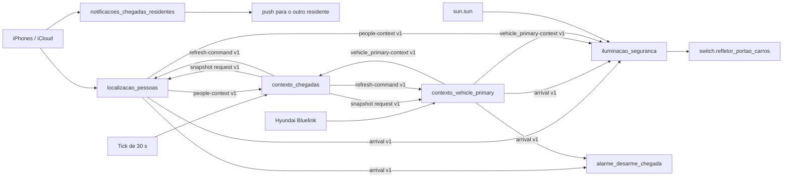
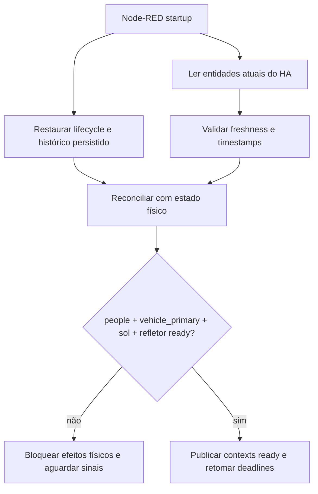

# Contexto de chegada e iluminação de segurança no Node-RED

Os flows relacionados ficam em `nodered/flows.json` e são divididos em cinco
abas:

| Flow | Responsabilidade |
| --- | --- |
| `localizacao_pessoas` | Ler e normalizar os trackers de resident_primary e resident_secondary, manter o armado individual, detectar aproximação/chegada e controlar o refresh dos iPhones. |
| `contexto_vehicle_primary` | Normalizar localização, motor e trava do vehicle_primary, manter `vehicle_primary_in_use`, detectar chegada, atualizar viagens e controlar o refresh do veículo. |
| `contexto_chegadas` | Sincronizar os snapshots periódicos e calcular somente a política conjunta `anyone_away`. Não interpreta GPS bruto nem envia notificações entre residentes. |
| `notificacoes_chegadas_residentes` | Avisar `resident_primary` quando `resident_secondary` entra em `chegando` e vice-versa, durante as 24 horas do dia e sem depender do veículo, iluminação ou reconciliação de contexto. |
| `iluminacao_seguranca` | Consumir os contratos de alto nível e decidir ligar/desligar `switch.refletor_portao_carros`, incluindo carência, timeout e anti-religamento. |

Essa separação impede que a iluminação conheça trackers, coordenadas, refresh
da Kia ou detalhes de viagem.

## Arquitetura



A comunicação usa `link in`/`link out`. Os links são contratos explícitos; não
há wire direto entre abas, MQTT intermediário, entidade auxiliar ou produtor
oculto em `global context`.

## Contratos entre flows

### `security.people-context.v1`

Produzido somente por `localizacao_pessoas`. Contém:

- `resident_primary` e `resident_secondary` já normalizados;
- `distance_m`, `gate_distance_m`, precisão e validade;
- `current_home` (tracker selecionado e fresco), `primary_home`,
  `any_tracker_home` e tempo do tracker primário em casa;
- `anyone_away`, menor distância observada e armado individual;
- metadados da transição que originou a atualização;
- `updated_at`, `valid`, `ready`, `stale`, `source` e `reason`. Cada pessoa
  também publica `updated_at`, `ready` e `stale`.

### `security.vehicle_primary-context.v1`

Produzido somente por `contexto_vehicle_primary`. Contém:

- distância e validade da localização;
- `home`, `away`, `approaching_home` e `arrived_home`;
- motor, trava e validade desses estados;
- `in_use` (`true`, `false` ou `null` enquanto pendente), `in_use_pending`,
  `in_use_reason`, lifecycle de viagem e armado de chegada;
- `updated_at`, `valid`, `ready`, `stale`, `reason` e `readiness_reason`.

### `security.arrival.v1`

Produzido por `localizacao_pessoas` ou `contexto_vehicle_primary` após validar uma
chegada. Preserva o contrato consumido pelo alarme:

- `source`: `resident_primary`, `resident_secondary` ou `vehicle_primary`;
- `arriving`: lista contendo a origem;
- `arrival_source_type`: `person` ou `vehicle_primary`;
- `arrival_stage`: `approach` ou `home`.
- `event_at`: epoch Unix em milissegundos da observação usada para dedupe.

### Snapshot e refresh

`contexto_chegadas` cria um `refresh_cycle_id`, solicita os dois snapshots e
só publica `security.refresh-command.v1` quando ambos retornam `ready: true` no
mesmo ciclo. O comando inclui `origin`, `reason`, `issued_at` e `ready`; isso
evita duplicação e torna loops diagnosticáveis. Cada domínio continua dono de
seu cooldown. Snapshots com `updated_at` anterior ao cache são ignorados.

## Entidades

### Pessoas

- `device_tracker.mobile_primary`
- `device_tracker.mobile_primary` (fallback iCloud)
- `device_tracker.mobile_primary`
- `device_tracker.mobile_primary` (fallback iCloud)
- ações móveis allowlisted via `public_bindings.call`, incluindo push e
  `request_location_update`

Quando ambos os trackers estão frescos e têm coordenadas confiáveis,
conserva-se o fallback anterior: vence o tracker que reporta a maior distância
de casa, porque a falha
observada foi o Companion App congelado numa posição antiga em casa. Se um
tracker disser `home`, `any_tracker_home` bloqueia uma entrada falsa no anel.
Uma saída completa observada ainda permite o aviso de retorno de qualquer um
dos residentes mesmo com o outro tracker atrasado.

### vehicle_primary

- `device_tracker.vehicle_primary`
- `binary_sensor.vehicle_primary_engine`
- `lock.vehicle_primary_door_lock`
- `button.vehicle_primary_force_refresh`
- `button.garagem_vehicle_primary_refresh_trip_info`
- `input_button.vehicle_primary_force_refresh_now` (solicitacao manual pelo mesmo
  coordenador; nao chama Bluelink diretamente)
- `sensor.vehicle_primary_refresh_coordinator` (espelho MQTT do estado/deadlines reais)
- entidades do dispositivo atualizadas pelo serviço `homeassistant.update_entity`

### Iluminação

- `sun.sun`
- `switch.refletor_portao_carros`
- notificações dos iPhones dos moradores

## Coordenadas e fallback

`HOME_LAT`, `HOME_LON`, `GATE_LAT` e `GATE_LON` vêm do ambiente do container;
coordenadas privadas nunca são versionadas. O cálculo só aceita GPS com
precisão de até 100 m. Sem coordenada confiável, usa-se `home`/`not_home` como
fallback. `unknown` e `unavailable` produzem `state_valid: false`. Precisão ruim
impede que coordenadas ou `home` confirmem chegada; `not_home` ainda pode armar
o retorno de forma conservadora. Nenhum desses casos gera chegada nem limpa o
armado anterior.

O alias público `device_tracker.vehicle_primary` preserva os estados nativos do
Home Assistant com `state_mode: passthrough`: `home` dentro da zona da casa,
`chegando` dentro da zona de aproximação e `not_home` fora das zonas. `away` não
é estado do tracker; é o booleano derivado no contrato
`security.vehicle_primary-context.v1`, usando primeiro coordenadas confiáveis e
depois `not_home` como fallback. O checker de bindings rejeita
`home_away` em `device_tracker`, pois esse modo apagaria a distinção entre
`chegando` e `not_home`.

## Regras de chegada preservadas

- Distância de armado: mais de 100 m de casa.
- Anel de aproximação: entrada em `zone.chegando` a partir de fora. O raio de
  aproximadamente 1500 m é definido em
  `homeassistant/packages/zonas_presenca.yaml`, não duplicado no JavaScript.
- `home -> chegando` é saída, nunca chegada.
- A entrada no anel gera `arrival_stage: approach` e não consome o armado.
- A entrada em casa ou até 300 m de casa/portão é a rede de segurança
  (`arrival_stage: home`) e consome o armado.
- Um tracker primário que já está em casa há mais de 10 min bloqueia o catch-up
  tardio do tracker secundário. Sem `last_changed`, o comportamento permanece
  fail-open para não perder uma chegada real.
- A chegada do vehicle_primary atualiza o histórico de viagens do dia; no estágio
  `approach`, também tenta um wake pontual do veículo.
- Atualizações de atributos do tracker também são observadas sem exigir troca
  de zona. Um deslocamento acumulado de pelo menos 250 m (ou maior que a soma
  das precisões GPS) solicita refresh do contexto, mas nunca autoriza sozinho
  a iluminação ou outra ação física.

## Notificações entre residentes

O tab `notificacoes_chegadas_residentes` observa diretamente os dois trackers
de cada residente. A transição de fora para `chegando` notifica o outro
residente imediatamente, sem consultar horário, sol, veículo ou os snapshots de
`contexto_chegadas`. A transição `home -> chegando` continua sendo tratada como
saída e não gera aviso. Um latch persistente evita duplicidade entre os dois
trackers e após restart; uma nova passagem por `not_home` rearma o aviso.

Os testes sintéticos de `localizacao_pessoas` também entram nesse tab. Eles
percorrem a mesma validação e o mesmo dedupe usando memória isolada de teste,
e enviam o push real porque a entrega da notificação é o efeito sob teste. O
título e a mensagem são identificados com `TESTE`; após o Home Assistant
aceitar a chamada, o status termina em `TESTE FINAL: push para <resident>
enviado`. O binding usa diretamente o serviço Mobile App para que a aceitação
corresponda ao caminho de push do celular, sem passar pela entidade intermediária
`notify.send_message`.

Quando o teste também satisfaz as condições de acendimento, mas o atuador está
`unknown`, `unavailable`, stale ou não reconciliado, os avisos de “seria ligado”
também são enviados com `TESTE` no título e na mensagem. O refletor, o alarme,
timers e todos os demais dispositivos continuam em dry-run.

## Freshness e `vehicle_primary_in_use`

Freshness é calculada com `last_updated` (ou `last_changed` como fallback),
sempre em epoch Unix UTC, milissegundos:

| Sinal | Janela | Ao expirar |
| --- | ---: | --- |
| trackers de resident_primary e resident_secondary | 15 min | pessoa `stale`, snapshot não ready; nunca vira `false` |
| localização do vehicle_primary | 30 min | localização `stale`; não confirma `home`/`away` para recovery |
| motor e trava | 5 min | sinal inválido/stale; `off` não é interpretado como evidência atual |
| snapshots derivados | monotônico por `updated_at` | antigo e futuro >60 s são descartados; conflito no mesmo timestamp preserva o primeiro |

O estado pertence exclusivamente a `contexto_vehicle_primary`:

- liga quando o motor é observado `on`;
- permanece ligado durante lacunas do backend da Kia;
- desliga com motor `off` fresco e carro em casa, ou com motor `off` e trava
  destravada frescos;
- após restart, uma viagem persistida só é restaurada como `true` quando a
  localização atual e fresca ainda confirma que o carro está fora;
- sem evidência suficiente publica `in_use: null`, `in_use_pending: true`, e a
  iluminação permanece bloqueada. Nunca converte stale automaticamente em
  `false`.

Mudanças confirmadas de motor são observadas simetricamente: `on` por 5 s e
`off` por 5 s entram imediatamente no normalizador. Isso evita esperar o
próximo snapshot periódico para iniciar ou encerrar o contexto de uso, mantendo
o mesmo filtro contra oscilações nos dois sentidos.

Quando uma chegada `not_home -> chegando` chega antes de a integração atualizar
o motor de `off` para `on`, `iluminacao_seguranca` preserva o evento por até 2
minutos. Um contexto posterior só faz replay se `in_use=true`, motor `on` atual,
válido e não stale, além de luminosidade ready. Enquanto o motor continuar
`off`, a chegada permanece pendente e não acende o refletor; ao expirar, é
descartada. O timestamp original é preservado, portanto atualizações repetidas
não estendem a janela.

O gate não usa apenas a leitura ao vivo do motor porque o backend brasileiro
pode manter esse sensor antigo durante uma viagem. A iluminação recebe apenas
`context.in_use` e não sabe como a trava foi calculada.

`security.vehicle_primary-context.v1` foi mantido em `v1` após a auditoria dos
consumidores reais do repositório. A ampliação de `in_use` de booleano para
`true | false | null` não é puramente aditiva, mas todos os consumidores estão
no mesmo conjunto de flows e usam comparação estrita com `true`; nenhum
consumidor externo ou legado foi encontrado. `null` bloqueia o gate e não é
interpretado como `false`. Uma fronteira externa futura deverá publicar uma
nova versão em vez de assumir essa compatibilidade interna.

## Acendimento

`iluminacao_seguranca` liga o refletor somente quando todas as condições são
verdadeiras:

1. há um evento `security.arrival.v1`;
2. `sun.sun` está `below_horizon`;
3. `vehicle_primary_in_use` é verdadeiro e o motor atual está `on`;
4. pessoas, vehicle_primary, sol e estado físico do refletor estão ready/reconciliados;
5. o refletor físico está `off` e não foi marcado como ativo por chegada;
6. não há supressão pós-desligamento ativa.

Depois de todos os gates, a ação grava no store `persistent` o lifecycle
`security_light_lifecycle_v1`: `active_by_arrival`, `on_since`,
`force_off_at`, dedupe recente e `updated_at`. Eventos barrados por claridade,
readiness ou estado do vehicle_primary não consomem o dedupe do refletor.

A origem da chegada pode ser `resident_primary`, `resident_secondary` ou
`vehicle_primary`. Quando o motor atual está `on`, a entrada de qualquer
residente em `chegando` aciona a avaliação mesmo que o tracker do veículo ainda
esteja em `not_home`, `home` ou outra zona válida; o veículo não precisa entrar
em `chegando` primeiro. Para residentes, `chegando` precisa ser precedido por
`not_home`, `unknown` ou `unavailable`. As duas transições de recuperação ficam
restritas à iluminação e não são publicadas como chegada geral para o desarme.

Também chama `switch.turn_on`, avisa os moradores e inicia o backstop de 15
minutos.

O primeiro ciclo que liga o refletor — ou que determinaria o acendimento, mas
encontra o atuador `unknown`, `unavailable`, stale ou não reconciliado — grava
um latch persistente de notificação. Enquanto esse latch estiver ativo, novas
chegadas não repetem avisos de `turn on` nem de “seria ligado”. Uma observação
física confirmada em `off` libera o latch; `on` o mantém mesmo que o Zigbee
fique indisponível logo depois.

## Cinco condições independentes de desligamento

| # | Condição | Efeito |
| --- | --- | --- |
| 1 | motor desligado e porta destravada | imediato, após o filtro de 5 s do evento do veículo |
| 2 | transição confirmada de resident_primary para `home` | após completar 90 s desde o acendimento |
| 3 | transição confirmada de resident_secondary para `home` | após completar 90 s desde o acendimento |
| 4 | transição confirmada do vehicle_primary para `home` | após completar 90 s desde o acendimento |
| 5 | refletor ativo por 15 min | imediato ao vencer o backstop |

Uma atualização genérica da trava não ignora o filtro de 5 s. A carência grava
`pending_off_at` e revalida a condição quando vence. O backstop grava
`force_off_at`. Após desligar, `cooldown_until` bloqueia religamento por cinco
minutos. Os três prazos são absolutos e são reconstruídos no restart; nenhum
depende exclusivamente de um `delay` residente em memória.

## Refresh

- Tick base: 30 s, com snapshot de pessoas e vehicle_primary.
- iPhones: quando qualquer pessoa ou o vehicle_primary está fora, 60 s; 30 s quando a
  menor distância dos trackers de pessoas é até 2000 m.
- vehicle_primary: 15 min quando alguém está fora; se todos estão em casa, 15 min apenas
  entre 07h e 22h.
- Entrada no anel: wake pontual do vehicle_primary, ainda protegido pelo cooldown do
  coordinator Kia/Hyundai.
- Mudança de zona ou deslocamento GPS significativo: solicita refresh imediato
  e marca motor/contexto como potencialmente stale. A posição de referência é
  persistida somente para dedupe; logs registram tipo de movimento e distância
  arredondada, nunca latitude/longitude.
- O timestamp dos iPhones é otimista, preservando o comportamento anterior.
- O refresh do vehicle_primary persiste tentativa, próxima tentativa e último sucesso.
  Falhas usam backoff exponencial de 1, 2, 4, 8 e no máximo 15 min; sucesso
  limpa tentativas e aplica o intervalo normal de 15 min. Depois do quinto
  estágio, o contador satura e as novas tentativas continuam limitadas a uma a
  cada 15 min; não há rajada no restart porque `next_allowed_at` é persistido.
- A chamada legada `homeassistant.update_entity` que acompanhava o refresh do
  vehicle_primary continua sincronizando os dois trackers de iPhone, mas agora por um
  contrato explícito `contexto_vehicle_primary -> localizacao_pessoas`; nenhuma entidade
  de pessoa permanece dentro do flow do veículo.

Comportamento estranho deliberadamente preservado: a distância usada para
escolher 30 s ou 60 s considera todos os trackers de pessoas, inclusive alguém
que esteja em casa. Assim, se apenas o vehicle_primary estiver fora e um morador estiver
em casa, o refresh dos iPhones pode continuar a cada 30 s. Corrigir isso seria
mudança funcional e deve ser tratado separadamente.

## Restart, persistência e readiness

`nodered/settings.js` mantém o store padrão `memoryOnly` e oferece o store
nomeado `persistent` (`localfilesystem`). Somente intenção e histórico limitado
optam por ele; entidades atuais do HA continuam sendo a verdade física. O
inventário completo está em
[`SECURITY_CONTEXT_RECOVERY_STATE_INVENTORY.md`](SECURITY_CONTEXT_RECOVERY_STATE_INVENTORY.md).
No container, o caminho é explicitamente `/data/context`, coberto pelo volume
`./nodered:/data`; cache e flush de 30 s são declarados no próprio settings.



O grupo visual `0. Startup / Reconciliação` consulta
`switch.refletor_portao_carros` no startup e a cada 60 s, além de acompanhar
mudanças físicas:

- físico `off` + lifecycle ativo: corrige o lifecycle, sem enviar serviço;
- físico `on` + lifecycle inativo: presume origem manual/desconhecida e não
  desliga;
- físico `on` + lifecycle válido por chegada: restaura carência e backstop;
- `unknown`/`unavailable`: marca `light_reconciled: false` e bloqueia ligar ou
  desligar.

Uma leitura física precisa ter sido observada nos últimos 2 min. Se um deadline
recuperado vencer durante indisponibilidade, ele é bloqueado e fica elegível
para novo agendamento assim que uma consulta física confiável reconciliar o
estado; o deadline absoluto original não é estendido.

O tick inicial ocorre após 2 s e converge assim que o HA responde. Se HA e
Node-RED reiniciarem juntos, snapshots parciais não liberam side effects. Se
apenas um reiniciar, os eventos `outputInitially` e o ciclo periódico
reconstroem o mesmo estado. Lifecycle corrompido, futuro absurdo ou com mais de
24 h é descartado; cooldown acima de 30 min também é invalidado.

## Fail-safe

- HA, localização, motor, trava, sol ou refletor indisponível: contexto não
  ready; não liga, não desliga e não anuncia uma chegada nova.
- Bluelink indisponível: mantém contexto confirmado apenas para futura
  revalidação e limita retry por backoff.
- Snapshot incompleto/antigo: não sobrescreve snapshot mais novo e não vira
  booleano falso.
- Snapshots com o mesmo timestamp e payload divergente preservam o primeiro e
  geram aviso; um snapshot realmente posterior `ready: false` prevalece para
  derrubar readiness de forma conservadora.
- Refletor ligado manualmente: preservado; somente lifecycle comprovadamente
  criado pela automação permite desligamento automático.
- Viagem ou chegada: dedupe com TTL de 10 min evita replay após restart; dados
  de dedupe não crescem sem limite.

## Organização visual

## Teste manual do motor e da chegada

Na aba `contexto_vehicle_primary`, o grupo de testes manuais mantém um estado
sintético cumulativo e isolado das entidades reais. A sequência recomendada é:

1. `RESETAR testes do vehicle_primary` (o motor sintético volta para `OFF`);
2. selecionar `Motor sintético do vehicle_primary → ON` ou `→ OFF`;
3. executar `vehicle_primary 1/3 → not_home`, `2/3 → chegando` e
   `3/3 → home`.

Os passos de localização de qualquer residente e do veículo preservam o último
estado de motor escolhido. Assim,
o mesmo cenário exercita o gate `vehicle_primary está em uso?` em
`iluminacao_seguranca`: `ON` produz contexto `in_use=true` com motor atual
válido e mostra `TESTE: vehicle_primary em uso — gate aprovado`; `OFF` produz
`in_use=false` e mostra `TESTE: aguardando motor ON — chegada preservada`. Se
o controle for alterado para `ON` dentro de 2 minutos, a mesma chegada é
reprocessada e o status muda para `TESTE: gate aprovado — continuando dry-run`.
O `test_mode` então atravessa disponibilidade do refletor, dedupe e lifecycle
isolado, chegando a `TESTE FINAL: ações simuladas — nenhum dispositivo
acionado`. Esse terminal registra que refletor, dois avisos e backstop seriam
executados, todos com `simulated=true` e `dispatched=false`; nenhum serviço de
dispositivo é chamado.

A cobertura manual e as exceções de segurança de todos os tabs Node-RED ficam
declaradas em `nodered/tools/manual-test-policy.json`. Um tab novo sem
estratégia, evidência e regressão correspondente falha em `flows:validate`.
Tabs novos ou alterados devem usar `manual_full_dry_run`: o teste percorre o
mesmo caminho lógico da produção e se separa apenas na fronteira final, para um
terminal sem fios de saída que declara `simulated=true` e
`dispatched=false`. Fluxos cujo replay completo não seja seguro permanecem
automatizados e documentam a justificativa, em vez de ganhar um botão físico.

As abas seguem `Eventos -> Normalização -> Contexto -> Decisão -> Ação`.
Grupos delimitam cada responsabilidade. `link nodes` são usados somente nas
fronteiras de domínio, no salto entre detecção e ações do vehicle_primary, no timeout e
nos testes manuais. O renderizador estático verifica a geometria:

```bash
cd nodered
FLOW_LAYOUT_DIR=/tmp/security-flow-layouts \
  node tools/render-flow-layout.mjs \
  localizacao_pessoas contexto_vehicle_primary contexto_chegadas iluminacao_seguranca
```

O aceite atual é zero wires acima de 500 px e zero wires voltando da direita
para a esquerda nas quatro abas.

## Validação

```bash
cd nodered
npm run flows:validate
npm run flows:test-security
npm run flows:test-alarm-arrival
```

`flows:test-security` executa 35 cenários de regressão, incluindo
estados inválidos, restart, eventos fora de ordem, simultaneidade e falha/sucesso
de refresh, inclusive movimento dentro da mesma zona, simetria de motor
`on`/`off`, replay real de chegada após atraso `off -> on` e preservação de
`home`/`chegando`/`not_home` com `away` derivado.
`flows:test-security-recovery` acrescenta 40 cenários de restart e recuperação;
`flows:test-security-adversarial`, mais 23 casos adversariais com relógio
controlado para reconciliação e deadlines. São replays offline dos
`function nodes` e uma validação estrutural;
não substitui um teste de campo com os iPhones, o veículo e a API Bluelink.
